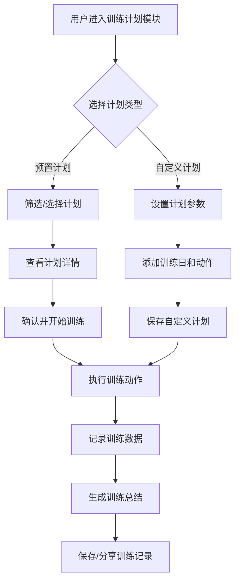

## 一、文档概述

本文档作为FitTracker健身工具App的产品需求规格说明，旨在定义产品的核心功能、交互逻辑、数据规则及非功能要求。文档覆盖训练计划、动作库、训练记录与统计等关键模块，明确用户场景与功能实现路径，为设计、前端、后端及测试团队提供统一开发依据。

文档将指导MVP版本快速上线以验证市场需求，同时为后续迭代提供扩展框架。随着产品开发进程和用户反馈，本需求文档将持续更新优化，确保产品功能与用户需求保持同步，最终实现解决用户"不知道练什么"和"无法衡量进步"的核心痛点目标。

### [(一)、文档目的](#t1-1)

本文档旨在为FitTracker健身工具App的全生命周期开发提供清晰、统一的指导框架。通过明确产品定位、功能需求、业务流程及非功能需求，确保产品设计、开发、测试、运营等各环节团队对产品目标和实现路径达成共识。

文档核心作用包括：作为产品设计的基准，定义用户需求与产品功能的映射关系；作为开发团队的技术实现指南，明确功能模块划分与接口规范；作为测试验收的依据，提供可量化的功能验证标准；作为项目管理的参考，辅助资源分配与进度规划；作为跨团队协作的沟通工具，确保市场、运营、技术等部门对产品认知一致。

通过本文档的制定与执行，将有效避免需求理解偏差、功能范围蔓延等常见项目风险，保障产品开发过程的有序性和最终产品的质量可控性，确保FitTracker能够精准解决用户"不知道练什么"和"无法衡量进步"的核心痛点。

### [(二)、适用范围](#t1-2)

本文档作为FitTracker健身工具App的产品需求规格说明，适用于产品全生命周期管理过程中的所有相关团队和人员，具体包括：

**产品团队**：作为产品规划、需求分析和功能定义的核心依据，指导产品路线图制定和迭代规划。产品经理可基于本文档进行需求优先级排序、功能规划和版本管理，确保产品演进符合用户需求和市场目标。

**设计团队**：UI/UX设计师可依据文档中的功能需求和用户场景，进行界面设计、交互流程设计和视觉风格定义，确保设计方案与产品需求保持一致。

**开发团队**：前后端开发工程师可根据文档中的功能描述、数据结构和业务规则，进行技术架构设计、数据库设计和代码实现，确保开发工作符合产品需求规格。

**测试团队**：测试工程师可基于本文档制定测试计划、设计测试用例、执行测试验证，并进行缺陷管理，确保产品功能符合需求定义和质量标准。

**相关业务部门**：包括运营、市场、客服等部门，可通过本文档了解产品功能和特性，为产品上线后的运营推广、市场宣传和用户服务提供支持。

本文档将作为产品开发过程中的核心参考资料，在产品全生命周期内指导各团队协同工作，确保产品从概念到发布的各个阶段都能保持一致性和高质量。各团队在执行相关工作时，应以本文档的需求描述为基准，如有变更需通过正式的需求变更流程进行管理。

### [(三)、术语定义](#t1-3)

#### 1. 产品相关术语
- **FitTracker**：本项目开发的健身工具App，提供训练计划制定、动作指导、训练记录与数据分析功能的移动应用
- **训练计划**：根据用户目标、健身水平和可用时间定制的周期性健身方案，包含训练日安排、动作组合、组数次数等要素
- **动作库**：FitTracker内置的标准化健身动作集合，包含动作名称、分类、示范视频、发力肌群和动作说明
- **训练记录**：用户每次训练的详细数据，包括完成的动作、组数、次数、重量、时长和主观感受等信息
- **训练统计**：对用户历史训练数据进行汇总分析后呈现的可视化图表和指标，反映用户训练趋势和进步情况

#### 2. 用户角色术语
- **普通用户**：注册并使用FitTracker基本功能的个人用户
- **新手用户**：健身经验少于3个月，需要基础指导的用户
- **进阶用户**：健身经验3-12个月，有一定训练基础的用户
- **资深用户**：健身经验1年以上，能够自主制定训练计划的用户
- **系统管理员**：负责内容管理、用户管理和系统维护的后台操作人员

#### 3. 业务流程术语
- **计划匹配**：系统根据用户输入的个人信息和健身目标推荐合适训练计划的过程
- **动作执行**：用户按照指导完成训练动作的过程，包含动作示范、倒计时和数据记录
- **数据同步**：用户训练数据从移动端上传至云端服务器的过程
- **周期回顾**：用户完成一个训练周期后查看训练效果和进步情况的过程
- **计划调整**：基于训练数据和用户反馈优化或修改训练计划的过程

#### 4. 系统异常术语
- **数据同步失败**：用户训练数据未能成功上传至服务器的情况
- **计划加载错误**：训练计划内容无法正常显示的技术问题
- **动作视频加载失败**：动作示范视频无法正常播放的情况
- **用户认证失败**：用户登录或身份验证过程中出现的异常
- **数据统计异常**：训练数据分析结果与实际情况不符的情况

## 二、产品背景与目标

随着健康意识提升和居家健身需求增长，健身App市场呈现快速发展趋势，但现有产品普遍存在两大核心痛点：用户"不知道练什么"和"无法衡量进步"。FitTracker应运而生，旨在通过科学的训练计划和数据化记录系统解决这些问题。

本章节将从市场需求、用户痛点和行业趋势三个维度分析产品开发背景，明确FitTracker的核心价值定位；同时阐述产品的短期目标（3个月内完成MVP开发并上线，获取5000名种子用户，建立基础用户反馈机制）和长期目标（12个月内完善核心功能，实现10万用户规模，成为细分领域有竞争力的健身工具产品），为后续产品设计与开发提供方向指引。

### [(一)、产品背景](#t2-1)

近年来，全球健身行业呈现爆发式增长，根据IHRSA（国际健康、 Racquet & 体育俱乐部协会）数据，2023年全球健身市场规模已突破960亿美元，中国健身人群渗透率从2015年的3.1%提升至2023年的7.2%。尽管健身需求持续增长，但行业调研显示，超过68%的健身初学者在开始训练的3个月内因缺乏明确指导而放弃，核心痛点集中在两个方面：

**1. 训练内容决策困境**  
调研数据表明，73%的普通用户面临"不知道练什么"的问题。现有解决方案存在明显不足：专业私教费用高昂（平均300-500元/节），超出85%用户的消费能力；免费健身App多采用通用模板，缺乏个性化适配；健身自媒体内容碎片化严重，用户难以构建系统训练体系。

**2. 训练效果量化缺失**  
82%的用户表示无法有效衡量健身进步，导致动力持续下降。传统记录方式（纸质笔记本、手机备忘录）操作繁琐且缺乏数据分析能力；现有App多侧重于单一维度记录（如步数、卡路里），未能建立科学的健身成效评估体系，无法直观展示用户的力量增长、体型变化等核心进步指标。

FitTracker应运而生，旨在通过智能化训练规划和数据化进步追踪，解决上述核心痛点。产品将整合运动科学理论与AI算法，为用户提供个性化训练方案，并建立多维度进步评估体系，填补当前市场在"科学指导"与"效果量化"方面的空白，降低健身入门门槛，提升用户训练持续性。

### [(二)、产品目标](#t2-2)

FitTracker健身工具App的产品目标分为短期实施目标与长期发展目标两个阶段，形成完整的产品生命周期规划。

**短期目标（0-6个月）**：
1. **开发与上线**：在3个月内完成核心功能开发，包括训练计划推荐、动作库与训练记录三大模块，确保产品基础可用性；4个月内完成内部测试与优化，5个月内正式发布上线。
2. **种子用户获取**：上线后1个月内通过精准营销获取5000名种子用户，用户留存率达到40%以上，日活跃用户(DAU)达到2000人。
3. **用户满意度**：通过用户反馈收集机制，实现85%以上的用户满意度，核心功能使用率达到70%，重点解决"不知道练什么"和"无法衡量进步"的用户痛点。

**长期目标（6-24个月）**：
1. **市场竞争力**：通过6-12个月的迭代优化，进入健身工具类App市场前20名；18-24个月内成为细分领域头部产品，用户规模达到50万，市场份额进入前10。
2. **功能完善**：构建个性化推荐算法，实现训练计划智能调整；拓展社交功能，建立用户社区；引入专业教练资源，提供付费指导服务。
3. **商业目标**：12个月内实现商业化验证，18个月内达到收支平衡，24个月内月营收突破50万元，建立可持续的商业模式。

产品目标实施将采用敏捷开发方法，每2周一个迭代周期，通过数据驱动持续优化产品功能，确保短期目标达成的同时，为长期发展奠定坚实基础。

## 三、用户分析

本章通过深入分析目标用户群体特征、核心需求及典型使用场景，构建精准用户画像，为产品功能设计提供依据。主要内容包括：识别健身新手、进阶健身者和目标驱动型健身者三类核心用户群体；剖析"不知道练什么"和"无法衡量进步"两大核心痛点；描绘家庭、健身房和户外等多元使用场景；并呈现2-3个典型用户画像示例，涵盖用户基本信息、健身目标、行为特征及需求痛点，为产品功能优先级确定和用户体验优化奠定基础。

### [(一)、目标用户群体](#t3-1)

FitTracker的目标用户群体主要分为三类，覆盖健身训练的不同阶段，各具特征与需求：

**1. 小白爱好者（新手期<6个月）**
特征：健身知识有限，训练经验不足，常感迷茫；设备条件有限，多为家庭或基础健身房训练；目标多为减脂塑形等基础需求。
核心需求：需要简单易懂的入门指导，避免运动损伤；需要明确的训练计划，解决"不知道练什么"的问题；需要基础动作教学和示范。
使用场景：初次接触健身，希望系统学习正确方法；每周训练2-3次，每次30-45分钟；通过App获取训练计划并跟随执行。

**2. 规律训练者（6个月~3年）**
特征：已掌握基础动作和训练知识，形成训练习惯；每周固定训练3-5次；开始关注训练效果和身体变化；有明确的阶段性目标。
核心需求：需要科学的进阶训练计划；需要记录训练数据并分析进步；需要多样化的训练内容避免枯燥；关注训练效率和效果提升。
使用场景：制定月度/季度训练目标；系统性记录每次训练的重量、组数、次数；定期查看训练数据统计，调整训练计划。

**3. 进阶训练者（3年+）**
特征：具备丰富训练经验和专业知识；训练目标明确且专业化（增肌、备赛等）；对训练数据有深度分析需求；可能指导他人训练。
核心需求：需要高度自定义的训练计划功能；需要专业的数据分析工具；需要动作库扩展和高级训练技术；需要与其他专业人士交流分享。
使用场景：制定周期化训练计划；精确记录和分析训练数据；创建自定义动作和训练方案；与同水平训练者交流经验。

### [(二)、用户画像示例](#t3-2)

#### 1. 健身新手：张明（28岁，程序员）
**基本信息**：28岁男性，互联网公司程序员，月收入15K，无系统健身经验，BMI 26（轻度超重），每周可安排3-4次健身，每次45-60分钟。

**需求痛点**：
- 完全不知道从何开始训练，面对健身房器材感到迷茫
- 担心动作不标准导致受伤
- 工作繁忙，需要高效、省时的训练方案
- 缺乏持续动力，容易半途而废

**期望功能**：
- 提供适合新手的入门训练计划，明确指导每天练什么
- 动作视频演示和步骤说明，确保训练动作标准
- 可根据时间灵活调整的训练方案
- 简单直观的进度记录和成就系统，增强坚持动力

#### 2. 有经验健身者：李婷（32岁，市场经理）
**基本信息**：32岁女性，市场经理，有2年健身经验，主要目标是塑形和维持健康，每周训练4-5次，偏好力量训练结合有氧运动。

**需求痛点**：
- 训练进入平台期，无法突破现有水平
- 缺乏科学的训练计划调整方法
- 难以系统记录训练数据，无法有效分析进步
- 希望针对特定部位进行强化但缺乏专业指导

**期望功能**：
- 可自定义训练计划，根据目标调整训练内容
- 详细的训练数据记录与趋势分析功能
- 针对特定肌群的动作推荐和训练方案
- 提供进阶训练技巧和突破平台期的方法

#### 3. 减脂目标用户：王浩（35岁，企业管理者）
**基本信息**：35岁男性，企业中层管理者，应酬较多，BMI 29（中度超重），希望在3个月内减重10公斤，时间紧张，每周可训练3次。

**需求痛点**：
- 无法坚持长时间运动，需要高效燃脂方案
- 缺乏饮食与运动结合的科学指导
- 工作压力大，难以保持训练规律性
- 体重波动大，容易产生挫败感

**期望功能**：
- 短时高效的HIIT训练计划
- 简单的饮食记录与建议功能
- 灵活的训练提醒和计划调整功能
- 体重和体脂变化趋势图表，直观展示进步

## 四、产品功能需求

本章详细阐述FitTracker健身工具App的核心功能模块及业务流程，围绕解决用户"不知道练什么"和"无法衡量进步"的核心痛点设计。主要包括三大功能模块：训练计划模块（提供个性化、科学的训练方案）、动作库模块（提供标准动作指导与示范）、训练记录与统计模块（记录训练数据并进行多维度分析）。各模块间协同工作，形成"计划-执行-记录-分析-调整"的完整健身闭环，帮助用户科学训练并直观感知进步，提升健身效果和用户粘性。

### [(一)、核心功能模块](#t4-1)

FitTracker健身工具App核心功能模块包含三大核心系统，各模块功能点、业务规则及交互逻辑如下：

**1. 训练计划模块**
- **功能点**：计划推荐、自定义计划、计划执行、进度追踪
- **功能描述**：基于用户目标、健身水平和可用设备智能推荐训练计划；支持用户手动创建个性化训练计划；提供计划日历视图和执行提醒；实时更新训练完成进度。
- **业务规则**：系统根据用户输入的健身目标（增肌/减脂/塑形）、经验水平（新手/中级/高级）和可用器械自动匹配推荐计划；用户可调整每日训练动作、组数和休息时间；计划执行完成率达到80%以上触发进度奖励机制。
- **页面元素**：计划卡片（包含训练日分布、难度等级、预计时长）、创建计划表单、日历视图、进度条、开始训练按钮。

**2. 动作库模块**
- **功能点**：动作分类浏览、动作详情、视频演示、难度筛选、收藏功能
- **功能描述**：提供超过200个标准健身动作的详细指导；按身体部位、训练类型和难度等级分类；每个动作包含3D动画演示、肌肉发力图解、动作要点和常见错误提示。
- **业务规则**：动作难度分为初级、中级、高级三个等级；用户可收藏常用动作并创建自定义动作列表；系统会根据用户训练历史推荐相关动作。
- **页面元素**：分类导航栏、动作列表卡片、动作详情页、视频播放器、难度标签、收藏按钮、相关动作推荐区。

**3. 训练记录与统计模块**
- **功能点**：训练日志、数据统计、进度图表、成就系统
- **功能描述**：自动记录每次训练的动作、组数、重量、次数和时长；生成周/月/年训练数据统计报表；通过折线图、柱状图可视化展示力量增长和训练频率；设置训练成就和里程碑。
- **业务规则**：系统自动计算训练容量（重量×次数×组数）；同一动作连续两周重量提升触发"力量突破"成就；每月训练天数达到20天解锁"训练达人"徽章。
- **页面元素**：训练记录表单、数据统计仪表盘、趋势图表、成就徽章墙、分享按钮。

各模块间通过用户ID和训练计划ID实现数据关联，确保训练数据的一致性和连续性。

### [1. 训练计划模块](#t4-1-1)

训练计划模块是FitTracker的核心功能之一，旨在解决用户"不知道练什么"的核心痛点。该模块提供双重解决方案：预置训练计划库和完全自定义计划创建。

预置训练计划库包含针对不同目标（增肌、减脂、塑形）、不同场景（家庭训练、健身房训练）和不同水平（初级、中级、高级）的专业计划，每个计划包含完整的训练周期、每日训练内容、动作说明和注意事项。用户可通过筛选条件快速找到适合自己的计划，点击"启用计划"即可一键将其添加到个人训练日程中，系统将按日推送当日训练动作清单。

自定义计划创建功能允许用户完全根据个人需求设计训练计划。用户可选择"创建新计划"，设置计划名称、训练频率、周期长度等基本信息，然后从动作库中选择训练动作，设置每组次数、组数、休息时间等参数，也可调整训练顺序和每周训练安排。系统提供计划预览功能，用户确认后即可保存并启用。

页面主要元素包括：计划列表区（展示推荐计划和我的计划）、计划详情页（包含计划概述、周期安排和每日训练内容）、计划创建编辑器（提供动作选择、参数设置和时间安排功能）。交互逻辑遵循"选择-配置-确认-执行"的流程，确保用户能够轻松完成计划设置。

数据字段包括：计划基本信息（ID、名称、描述、目标类型、难度级别、适用场景）、周期信息（总时长、训练频率、每周安排）、训练内容（每日训练ID、包含动作列表、每个动作的组数、次数、重量、休息时间）以及用户关联信息（用户ID、启用状态、开始日期、完成进度）。

### [2. 动作库模块](#t4-1-2)

动作库模块是FitTracker的核心功能组件，旨在为用户提供标准化、系统化的健身动作资源。系统将建立中心化标准动作库，每个动作包含高清图片说明及视频演示占位区域，详细展示动作要领、发力肌群及注意事项。

**核心功能包括：**

1. **动作浏览与筛选**：支持按肌群（胸、背、肩、腿等）、器械类型（哑铃、杠铃、器械、徒手等）、难度等级（初级、中级、高级）等多维度组合筛选，帮助用户快速找到所需动作。

2. **动作详情展示**：每个动作详情页包含标准示范图、动作说明、主要发力肌群图示、呼吸节奏指导及常见错误提示，为用户提供专业指导。

3. **个人纪录追踪**：系统自动记录用户每个动作的个人历史最高重量、最大次数及最佳组数，在动作详情页显著展示，直观反映用户进步轨迹。

4. **数据关联与更新**：当用户完成训练并记录数据后，系统将自动比对并更新相应动作的个人纪录，无需手动操作。

**页面元素与交互**：动作列表采用卡片式布局，显示动作名称、主要肌群标签及难度标识；支持下拉刷新获取最新动作数据；详情页支持左右滑动切换同类动作；个人纪录区域采用醒目的数字展示及趋势图标。

**数据字段定义**：每个动作包含基础信息（ID、名称、别名、难度）、媒体资源（主图URL、视频URL）、分类信息（肌群标签、器械类型）、技术参数（标准次数范围、建议休息时间）及用户关联数据（个人最佳纪录、最近使用时间）。

#### [3. 训练记录与统计模块](#t4-1-3)

训练记录与统计模块是FitTracker的核心功能之一，旨在解决用户"无法衡量进步"的核心痛点。模块采用轻量级设计，提供便捷的训练记录与多维度数据统计分析功能。

**训练记录流程**：用户开始训练后，系统自动加载当日计划动作序列，用户可按组录入实际完成的重量、次数、组数及休息时间。支持语音录入和快捷加减操作，单次记录操作控制在3秒内完成。数据实时保存至本地数据库，网络恢复后自动同步云端。

**统计查看流程**：用户可通过日历热力图直观查看训练频率分布，点击任意训练日可查看当日详细训练数据。统计面板提供多维度分析：周/月训练量趋势、各部位训练占比、主要动作力量进步曲线及训练时长分布等。支持关键指标（如深蹲最大重量）的长期趋势追踪。

**页面元素与交互**：记录页面采用卡片式设计，每个动作组包含重量选择器（支持kg/lb切换）、次数输入框、休息计时器和完成状态标记。统计页面提供切换视图（图表/列表）、时间范围筛选（周/月/季度）和数据导出功能。

**数据字段定义**：记录数据包括训练ID、用户ID、训练日期、动作ID、组数、重量、次数、完成状态、休息时间、备注；统计数据包括训练频率、训练总量（重量×次数）、平均强度、部位分布、动作熟练度评分等。

**交互逻辑补充**：支持训练中途暂停与恢复，自动计算训练总时长；提供常用重量快速选择功能，基于历史数据智能推荐；训练完成后自动生成简短总结报告，突出进步点与待改进项。

### [(二)、业务流程](#t4-2)

#### 1. 预置计划选用流程
用户进入训练计划模块后，系统展示推荐计划列表（基于用户画像和健身目标），用户可通过"增肌"、"减脂"、"塑形"等标签筛选计划。选定计划后，系统展示计划详情（周期、难度、每日训练内容），用户确认后选择"开始训练"或"加入收藏"。系统自动记录计划开始时间，并生成训练日历视图。

#### 2. 自定义计划创建流程
用户点击"创建计划"按钮，依次完成以下步骤：设置计划基本信息（名称、周期、训练频率）→ 添加训练日 → 从动作库选择动作并设置参数（组数、次数、休息时间）→ 预览计划 → 保存计划。系统支持计划模板保存功能，用户可将自定义计划保存为模板供日后复用或分享。

#### 3. 训练记录流程
用户从计划列表选择当日训练，系统展示训练动作序列。每个动作完成后，用户记录实际完成组数、次数、重量及主观感受（1-5星），支持语音快捷录入。全部动作完成后，系统生成训练总结（训练时长、总组数、总次数、消耗热量估算），用户可添加训练笔记并选择是否发布至社区。系统自动将训练数据同步至统计模块。



## 五、非功能需求

本章详细定义FitTracker健身工具App的非功能需求，确保产品在性能、安全、兼容性和可用性方面达到预期标准。性能需求关注App响应速度与稳定性，保障用户流畅体验；安全需求涉及用户数据保护与隐私安全；兼容性需求确保App在不同设备环境下正常运行；可用性需求致力于提升产品易用性与用户体验。这些非功能需求是产品质量的重要保障，与功能需求共同构成完整的产品需求体系，为开发团队提供明确的技术指标与质量标准。

### [(一)、性能需求](#t5-1)

为确保FitTracker应用提供流畅的用户体验，特制定以下性能指标要求：

1. **训练记录页面加载性能**：冷启动状态下，训练记录页面从点击到完全渲染完成的时间需控制在2秒以内。页面首次加载时应优先显示基础框架和核心数据，采用骨架屏技术提升用户感知速度，非关键数据可延迟加载。

2. **训练数据保存响应**：用户完成一组训练并提交数据时，系统响应时间需≤500ms。采用本地优先存储策略，确保在网络不稳定情况下数据不丢失，后台自动同步机制应在不影响用户操作的情况下完成数据上传。

3. **统计图表加载性能**：各类统计图表（包括周/月训练量、肌肉群训练分布、重量变化趋势等）从请求到完整展示的时间需≤1.5秒。实现数据预加载和缓存机制，对高频访问的统计数据进行本地缓存，缓存有效期设为24小时。

4. **动作库列表加载性能**：动作库列表采用分页加载机制，首屏加载时间≤1秒，每次滑动加载下一页的响应时间≤800ms。列表项采用图片懒加载策略，优先加载可视区域内容，图片资源进行压缩处理，平均单张图片大小控制在50KB以内。

5. **离线操作支持**：应用需支持基本的离线操作功能，在无网络环境下仍能记录训练数据，待网络恢复后自动同步。本地数据库需优化查询性能，确保在数据量达到1000条训练记录时，查询响应时间仍保持在300ms以内。

### [(二)、安全需求](#t5-2)

为保障用户数据安全与隐私保护，FitTracker健身工具App需满足以下安全需求：

1. **数据传输安全**：所有用户训练数据、个人信息及交互内容需通过HTTPS协议进行全链路加密传输，确保数据在传输过程中不被窃取或篡改。服务器端需配置TLS 1.2及以上版本的加密协议，并实施证书轮换机制。

2. **数据存储与销毁**：用户训练记录、身体数据等敏感信息需加密存储。提供用户数据导出功能，支持JSON和CSV格式，便于用户备份个人数据。当用户发起账户删除请求后，系统需在7个工作日内完成所有个人数据的物理删除，包括主数据库、备份及日志系统中的相关信息，并提供删除完成凭证。

3. **身份认证与授权**：采用OAuth 2.0授权框架结合JWT（JSON Web Token）实现安全认证机制。支持多种登录方式：手机号+验证码登录、Apple ID登录（iOS平台）及Google账号登录（Android平台）。实施密码策略（如长度不少于8位，包含字母和数字组合），并支持生物识别登录（指纹/面容识别）。

4. **访问控制**：实施基于角色的访问控制(RBAC)，严格限制内部人员对用户数据的访问权限。所有敏感操作需进行二次验证，并保留完整的操作日志，日志保存期限不少于1年。

5. **合规要求**：需符合GDPR、CCPA等国际数据保护法规要求，明确告知用户数据收集范围与用途，获得用户明确授权，并提供数据使用偏好设置选项。

### [(三)、兼容性需求](#t5-3)

为确保FitTracker健身工具App能够覆盖目标用户群体并提供一致的使用体验，本章节定义了应用的兼容性需求：

1. **操作系统版本支持**
   - HarmonyOS平台：支持HarmonyOS 3.0（API Level 9）及以上版本
   - 目标API Level：10+
   - 说明：覆盖HarmonyOS 3.0及以上版本的华为设备，充分利用ArkUI声明式UI和Stage Mode特性

2. **屏幕尺寸适配**
   - 支持主流华为移动设备屏幕尺寸，包括：
     - 手机端：适配主流华为手机分辨率
     - 平板端：适配华为MatePad系列（基础适配）
     - 2in1设备：基础适配支持
   - 采用基于vp单位的响应式布局原则，确保界面元素在不同尺寸设备上合理布局
   - 支持竖屏和横屏两种显示模式

3. **显示模式支持**
   - 支持系统级暗黑模式与浅色模式自动切换
   - 颜色资源使用`$r('app.color.xxx')`统一管理，确保双主题适配
   - 确保所有UI元素在两种模式下均保持良好的可读性和视觉一致性

4. **平台策略**
   - MVP阶段：仅开发HarmonyOS平台应用
   - 技术实现：采用ArkTS + ArkUI 声明式开发范式，Stage Mode架构
   - 数据存储：基于@ohos.data.preferences的本地持久化方案，无后端依赖
   - 后续迭代：评估跨平台扩展可行性

5. **兼容性测试要求**
   - 在HarmonyOS主流机型上进行功能和UI兼容性测试
   - 确保在离线环境下的应用稳定性（本地优先架构）
   - 定期进行HarmonyOS系统版本更新后的兼容性验证

#### [(四)、可用性需求](#t5-4)

为确保用户训练记录过程的流畅性和数据安全性，FitTracker健身工具App需满足以下可用性需求：

**1. 训练记录防误触机制**
- 在训练记录界面，所有关键操作按钮（如"结束训练"、"删除记录"等）需设置防误触保护
- 实现方式：关键按钮需长按2秒以上或滑动确认后方可执行操作
- 训练中误触返回键时，弹出确认对话框，防止意外退出训练界面

**2. 训练结束二次确认**
- 用户点击"结束训练"按钮后，系统需弹出二次确认界面
- 确认界面需显示本次训练的关键信息（训练时长、完成动作数等）
- 用户需明确点击"确认结束"按钮方可完成训练记录，点击"取消"则返回训练界面继续训练

**3. 离线数据暂存与自动同步**
- 当检测到网络连接中断时，系统自动切换至离线模式，继续记录训练数据
- 离线状态下，所有训练数据（动作、组数、重量、次数、时间戳等）暂存于本地数据库
- 应用需定期检测网络状态，当网络恢复连接后，自动将离线数据同步至云端服务器
- 同步过程中需保证数据完整性，避免重复记录或数据丢失
- 同步完成后，通过本地通知告知用户数据已成功同步

**4. 异常情况处理**
- 应用意外关闭或设备电量耗尽时，重新启动后可恢复最近一次未完成的训练记录
- 提供手动同步功能，允许用户在需要时主动触发数据同步操作
- 所有离线数据需进行加密存储，保障用户隐私安全

## 六、需求优先级划分

本章对FitTracker健身工具App的所有功能需求进行优先级划分，采用P0-P2三级分类法，确保开发资源合理分配和产品迭代有序推进。P0级为核心功能，需在MVP版本实现；P1级为重要功能，计划在上线后3个月内完成；P2级为优化功能，根据用户反馈和业务发展逐步实现。优先级划分基于用户核心痛点解决程度、技术实现难度及产品战略目标，为开发团队提供明确的开发顺序指导，确保产品上线即具备核心价值，同时为后续迭代奠定基础。

## 七、验收标准

本章定义FitTracker健身工具App的验收标准，作为产品交付的依据。验收标准涵盖功能、性能和安全三个维度，确保产品满足需求规格并具备良好的用户体验。功能验收将验证各核心模块功能实现的完整性和准确性；性能验收关注App在不同环境下的响应速度和稳定性；安全验收确保用户数据保护和系统安全。本章内容将为测试团队提供明确的验收依据，为产品上线质量提供保障。

## 八、附录

本章作为FitTracker健身工具App产品需求文档的补充部分，主要包含需求变更记录和参考文档两方面内容。需求变更记录将系统追踪产品需求的所有修改历史，包括变更日期、变更内容、变更原因、影响范围及审批状态，确保需求变更过程透明可追溯。参考文档部分则汇集了产品设计与开发过程中所依据的行业标准、竞品分析报告、用户调研报告、技术规范及相关法律法规文件，为各团队提供必要的背景信息和参考依据。本章内容将随产品迭代持续更新，为项目团队提供完整的需求管理和信息查阅支持。

### [(一)、需求变更记录](#t8-1)

需求变更记录用于追踪产品需求在开发过程中的所有变更情况，确保团队成员对需求变化有统一认知，减少沟通成本，控制项目范围。变更记录采用表格形式管理，包含以下核心要素：

| 变更ID | 变更日期 | 变更内容 | 变更原因 | 影响范围 | 变更人 | 审批状态 |
|--------|----------|----------|----------|----------|--------|----------|
| RC-001 | YYYY-MM-DD | 描述具体变更内容，如"调整训练计划模块中初级用户默认计划时长从45分钟减少至30分钟" | 说明变更原因，如"用户调研显示初级用户对45分钟训练时长接受度低，完成率仅35%" | 列出受影响的模块和功能，如"训练计划生成算法、UI界面展示、进度统计逻辑" | 记录变更提出人，如"张晓明(产品经理)" | 记录审批状态，如"已审批/待审批/已拒绝" |

变更管理流程遵循以下步骤：1)变更提出：由相关人员提交《需求变更申请表》，详细说明变更内容和理由；2)变更评估：产品负责人组织技术、测试等相关人员评估变更对项目进度、成本和质量的影响；3)变更审批：根据评估结果，由产品负责人或项目负责人审批；4)变更实施：审批通过后，更新相关文档并通知团队执行变更；5)变更验证：变更实施后进行验证，确保符合预期。

所有需求变更必须记录在案，未经过审批的变更不得实施。对于重大变更（影响开发周期超过3天或涉及核心功能调整），需组织专项评审会议讨论决定。变更记录应及时更新并同步至项目管理平台，确保所有团队成员能够查阅最新需求状态。

### [(二)、参考文档](#t8-2)

本章节列出了在FitTracker健身工具App产品规划与设计过程中所参考的关键文档，这些文档为产品定位、功能设计和用户体验优化提供了重要依据：

1. **市场调研报告**
   - 《2023年中国健身App市场分析报告》- 艾瑞咨询，2023年Q2
   - 《全球健身科技产品趋势研究》- IDC数字健康部门，2023年
   - 《健身类应用用户增长与留存策略白皮书》- 易观分析，2023年

2. **竞品分析文档**
   - 《主流健身App功能对比分析报告》（内部文档），2023年8月
   - 《Keep、FitTime、薄荷健康产品策略研究》（内部文档），2023年9月
   - 《国际健身App市场竞品分析》- App Annie，2023年Q3

3. **用户研究报告**
   - 《健身新手用户需求调研报告》（内部用户研究），2023年7月
   - 《健身App用户流失原因深度访谈》（内部文档），2023年8月
   - 《不同健身目标用户行为特征分析》- 企鹅智酷，2023年

4. **行业标准与规范**
   - 《运动健身应用数据安全指南》- 国家信息安全标准化技术委员会
   - 《健身动作指导视频制作规范》（内部标准），2023年
   - 《健康数据隐私保护实施细则》- 参考GDPR与国内相关法规

5. **技术参考文档**
   - 《ArkTS语言编程规范》（HarmonyOS开发者文档）
   - 《ArkUI 声明式开发范式指南》（HarmonyOS开发者文档）
   - 《@ohos.data.preferences 持久化最佳实践》
   - 《@ohos/hypium 单元测试框架使用指南》
   - 《HarmonyOS Stage Mode 应用架构设计》

以上参考文档将作为产品设计与开发的重要依据，确保FitTracker在市场定位、功能设计和用户体验方面符合行业趋势和用户需求。相关文档的最新版本可通过产品部文档库获取。

---

## 九、技术方案设计

本章基于HarmonyOS Stage Mode架构和ArkTS开发规范，定义FitTracker的技术方案，包括技术栈选型、分层架构设计、状态管理策略及关键设计决策。

### [(一)、技术栈选型](#t9-1)

| 层次 | 技术选型 | 说明 |
|------|---------|------|
| 平台 | HarmonyOS Stage Mode | API Level 10+，支持Phone/Tablet/2in1 |
| 语言 | ArkTS | TypeScript 超集，遵循ArkTS严格模式约束 |
| UI框架 | ArkUI 声明式开发 | @Component / @Entry 装饰器，声明式UI范式 |
| 构建工具 | hvigor | HarmonyOS 官方构建工具 |
| 包管理 | ohpm | HarmonyOS 官方包管理器 |
| 本地存储 | @ohos.data.preferences | 键值对存储，fit_tracker_ 前缀命名 |
| 日志 | hilog | 按级别分类输出 |
| 单元测试 | @ohos/hypium | HarmonyOS 官方测试框架 |

### [(二)、分层架构设计](#t9-2)

采用经典三层架构，严格遵循单向依赖原则：

```
entry/src/main/ets/
├── pages/              # 页面层：@Entry 页面组件
│   ├── Index.ets                   # 主页：训练计划列表 + 今日训练
│   ├── WorkoutRecorderPage.ets     # 训练记录页：计时器、组数录入、1RM计算
│   ├── StatsPage.ets               # 统计页：周统计 + 日历热力图
│   └── ExerciseDetailPage.ets      # 动作详情页：信息展示 + 个人纪录
├── components/          # 组件层：可复用 @Component 组件
│   ├── AppButton.ets               # 通用按钮（主色/次要/幽灵 + loading）
│   ├── AppCard.ets                 # 通用卡片容器
│   └── AppInput.ets                # 通用输入框
├── common/
│   ├── services/        # 服务层：单例业务服务
│   │   ├── TrainingPlanService.ets  # 训练计划CRUD、预设计划
│   │   ├── WorkoutSessionService.ets # 训练记录持久化、统计、1RM
│   │   ├── ExerciseService.ets      # 动作库数据
│   │   └── AuthService.ets          # 模拟认证（内存）
│   ├── styles/          # 设计令牌
│   │   └── DesignTokens.ets         # 颜色、字体、间距、圆角、阴影
│   └── utils/           # 工具函数
│       └── ValidationUtils.ets      # 手机号/密码校验
├── model/              # 数据模型层（类型定义）
│   └── DataModels.ets              # 训练计划、会话、动作等接口定义
├── entryability/       # 应用生命周期
│   └── EntryAbility.ets
└── entrybackupability/ # 备份扩展
    └── EntryBackupAbility.ets
```

**分层依赖规则**：
- pages → components / services / model / utils
- components → model / styles（不可直接访问 services）
- services → model（不可引用 pages 或 components）
- model → 无依赖（纯类型定义）

### [(三)、状态管理策略](#t9-3)

| 装饰器 | 使用场景 | 本项目应用 |
|--------|---------|-----------|
| @State | 组件内部状态 | 页面级别的 loading、dataList、currentTab |
| @Prop | 父→子单向传递 | 组件接收只读配置参数 |
| @Link | 父子双向绑定 | 表单输入控件 |
| @Provide / @Consume | 跨层级传递 | 当前用户信息、当前训练计划ID |
| @StorageLink / @StorageProp | 全局状态 | 暗黑模式开关、语言设置 |

**状态管理原则**：
- 避免不必要的状态嵌套，及时释放不用的资源
- 服务层不持有 @State，通过回调/返回值传递数据
- 复杂对象使用显式 class 定义而非匿名对象字面量，遵循 ArkTS 严格模式

### [(四)、数据持久化设计](#t9-4)

**存储方案**：基于 `@ohos.data.preferences` 的键值对存储。

| Store 名称 | Key | 数据类型 | 说明 |
|-----------|-----|---------|------|
| fit_tracker_plans | my_plans | TrainingPlan[] | 用户自定义计划列表 |
| fit_tracker_plans | current_plan_id | string | 当前启用的计划ID |
| fit_tracker_sessions | sessions | WorkoutSession[] | 历史训练记录数组 |
| fit_tracker_auth | current_user | UserInfo | 当前登录用户信息 |

**序列化方式**：JSON.stringify / JSON.parse，读写统一通过单例 Service 层封装。

### [(五)、关键设计决策](#t9-5)

1. **本地优先，无后端**：MVP阶段不依赖任何远程服务，所有数据本地存储，降低开发复杂度和用户隐私风险。
2. **单例 Service 模式**：每个 Service 通过 `export default new ClassName()` 导出单例，调用方直接引用，禁止使用 `new` 实例化。
3. **设计令牌体系**：所有颜色、字体、间距、圆角、阴影统一定义在 `DesignTokens.ets` 中，组件通过 `ColorTokens.*` / `FontTokens.*` 引用，禁止硬编码。
4. **ArkTS 严格模式合规**：禁止 `any`/`unknown` 类型、禁止解构赋值、禁止 `for..in`、禁止索引访问 `obj["field"]`、禁止展开运算符用于对象等。
5. **组件单一职责**：每个 `@Component` 不超过 300 行，复杂页面拆分为多个子组件。

---

## 十、模块实现计划

本章定义 FitTracker 各模块的逐步实现计划，按优先级分阶段执行，每个阶段有明确的交付物和验收标准。

### [(一)、Phase 1 — 基础架构搭建](#t10-1)

**目标**：搭建项目骨架，定义设计令牌和通用组件，确立代码规范。

| 任务 | 内容 | 交付物 | 优先级 |
|------|------|--------|--------|
| 1.1 设计令牌 | 定义 ColorTokens、FontTokens、SpacingTokens、RadiusTokens、ShadowTokens，覆盖亮色/暗色双主题 | `DesignTokens.ets` | P0 |
| 1.2 通用组件 | 实现 AppButton（主色/次要/幽灵 + loading 状态）、AppCard（通用卡片容器）、AppInput（带校验的输入框） | `components/*.ets` | P0 |
| 1.3 路由配置 | 在 `module.json5` 和 `main_pages.json` 中注册所有页面路由 | 路由配置 | P0 |
| 1.4 数据模型 | 定义 TrainingPlan、WorkoutSession、Exercise、UserInfo 等核心接口/类 | `model/DataModels.ets` | P0 |
| 1.5 工具函数 | 实现 ValidationUtils（手机号、密码校验）及通用工具函数 | `utils/*.ets` | P1 |

**验收标准**：
- 所有 .ets 文件通过 ArkTS 编译，无严格模式违规
- DesignTokens 覆盖双主题
- 通用组件在 Index 页面中渲染正常

### [(二)、Phase 2 — 服务层实现](#t10-2)

**目标**：实现所有业务服务，建立数据持久化能力。

| 任务 | 内容 | 依赖 | 优先级 |
|------|------|------|--------|
| 2.1 AuthService | 模拟用户认证（内存 Map）、登录/注册/登出 | 1.4 | P0 |
| 2.2 TrainingPlanService | 5 个预设计划、计划 CRUD、当前计划管理、preferences 持久化 | 1.4 | P0 |
| 2.3 WorkoutSessionService | 训练记录保存/加载、周统计聚合、1RM(Epley)计算、个人纪录追踪、preferences 持久化 | 1.4 | P0 |
| 2.4 ExerciseService | 动作库数据（标准动作信息、肌群分类、难度等级） | 1.4 | P1 |
| 2.5 首选项存储封装 | 统一 preferences 初始化、读写、flush 逻辑 | 1.4 | P0 |

**验收标准**：
- 所有 Service 单例可正常实例化
- preferences 读写操作正确（写入后重启 App 数据不丢失）
- 1RM 计算公式正确：`weight * (1 + reps / 30)`
- 预设计划包含 5 个不同目标的完整训练方案

### [(三)、Phase 3 — 核心页面实现](#t10-3)

**目标**：实现所有核心页面，打通"计划 → 训练 → 记录 → 统计"完整闭环。

| 任务 | 内容 | 依赖 | 优先级 |
|------|------|------|--------|
| 3.1 Index 主页 | 训练计划列表、今日训练概览、快速开始训练入口 | 1.2, 2.2 | P0 |
| 3.2 WorkoutRecorderPage | 实时计时器、组数/重量/次数录入、1RM 实时显示、训练保存、暂停/恢复 | 1.2, 2.3 | P0 |
| 3.3 StatsPage | 周训练统计面板、日历热力图（5级绿色）、训练频率可视化 | 1.2, 2.3 | P0 |
| 3.4 ExerciseDetailPage | 动作详情展示、肌群标签、个人纪录展示 | 1.2, 2.4 | P1 |

**验收标准**：
- Index：计划列表正常展示，点击可进入训练记录页
- WorkoutRecorderPage：计时器运行准确、组数录入流畅、1RM 实时更新、保存后数据持久化
- StatsPage：热力图渲染正确、统计数据准确
- 所有页面支持暗黑/浅色双主题
- 页面跳转通过 `router.pushUrl` 实现，参数传递正确

### [(四)、Phase 4 — 测试与优化](#t10-4)

**目标**：编写单元测试、性能优化、UI 细节打磨。

| 任务 | 内容 | 优先级 |
|------|------|--------|
| 4.1 单元测试 | 对 Service 层、Utils 层编写 hypium 测试用例 | P0 |
| 4.2 长列表优化 | Index 和 StatsPage 中的列表使用 LazyForEach 替代 ForEach | P1 |
| 4.3 图片性能 | 为图片设置固定宽高，避免不必要的重排 | P1 |
| 4.4 组件复用优化 | 高频创建的组件添加 @Reusable 装饰器 | P1 |
| 4.5 UI 细节打磨 | 动画过渡、加载态/空态/错误态处理、暗黑模式适配检查 | P2 |

---

## 十一、测试策略

本章定义 FitTracker 的测试策略，确保代码质量和功能正确性。

### [(一)、单元测试](#t11-1)

**测试框架**：`@ohos/hypium`

**测试范围与用例**：

| 测试对象 | 测试用例 | 优先级 |
|---------|---------|--------|
| TrainingPlanService | 预设计划加载、计划 CRUD、当前计划切换、空数据边界 | P0 |
| WorkoutSessionService | 训练记录保存/加载、周统计聚合正确性、1RM 计算（边界值）、个人纪录更新逻辑、空数据边界 | P0 |
| AuthService | 注册/登录/登出流程、重复注册处理、密码校验 | P0 |
| ExerciseService | 动作库数据完整性、按肌群筛选、按难度筛选 | P1 |
| ValidationUtils | 手机号格式校验（有效/无效/边界）、密码强度校验 | P1 |
| 1RM 计算 | Epley 公式：`weight * (1 + reps / 30)`，测试边界值（reps=1, reps=30, weight=0） | P0 |

**测试原则**：
- 每个 Service 方法至少覆盖正常路径和一个异常边界
- 使用 `describe` / `it` 组织测试用例
- 测试文件位于 `entry/src/ohosTest/ets/test/` 目录下
- 禁止使用 `any` / `unknown` 类型，禁止删除测试以"通过"测试

### [(二)、组件测试](#t11-2)

| 测试对象 | 验证内容 |
|---------|---------|
| AppButton | 三种 variant 渲染正确、loading 状态显示、点击事件触发 |
| AppCard | 子组件渲染、不同尺寸适配 |
| AppInput | 输入绑定、错误状态显示 |

### [(三)、性能测试](#t11-3)

| 场景 | 指标 | 目标值 |
|------|------|--------|
| 训练记录页加载 | 冷启动渲染时间 | ≤ 2s |
| 训练数据保存 | API 响应时间 | ≤ 500ms |
| 统计图表渲染 | 数据到展示 | ≤ 1.5s |
| 动作库列表 | 首屏加载 | ≤ 1s |
| 长列表滚动 | LazyForEach 帧率 | ≥ 55fps |
| 离线操作 | 1000条记录查询 | ≤ 300ms |

### [(四)、ArkTS 编译检查](#t11-4)

每次代码提交前必须确保：
- 无 `any` / `unknown` 类型使用
- 无 `as const` 断言
- 无解构赋值 / 解构声明
- 无 `for..in` 循环
- 无 `obj["field"]` 索引访问（除 TypedArray）
- 无展开运算符用于对象
- 所有 import 位于文件顶部
- 无 `Function.apply/bind/call`
- 对象字面量对应显式 class/interface

