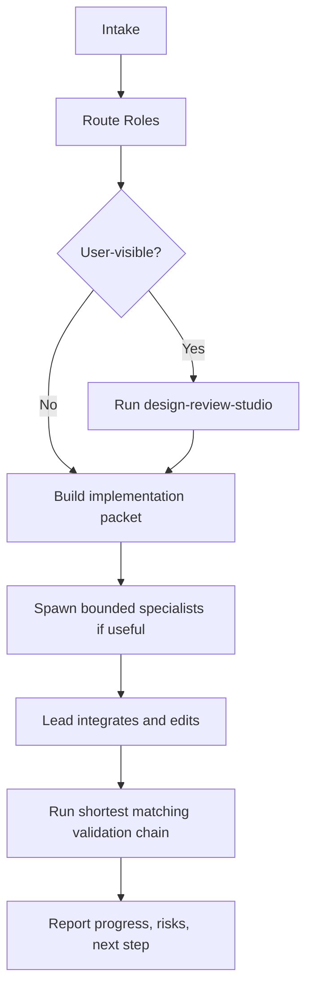

# FitTracker Agent Team Workflow Overlay

这份文档是 `agent-team-studio` 和 `design-review-studio` 在 FitTracker 仓库内的项目适配层。

目标只有一个：让后续开发默认按“主控经理 + 职业分工 specialist + 轻量验证”的方式稳定推进，而不是每轮重新发明流程。

## 1. 项目定位

FitTracker 默认是移动端训练工具，不是营销页，也不是内容社区。

产品体验目标固定为：

- 信息清晰
- 操作高效
- 数据可扫读
- 训练路径连续
- 反馈明确
- 视觉有完成度，但不过度装饰

## 2. 默认团队结构

### 常驻主线

- Delivery Lead / 主控经理
- App Engineer / HarmonyOS 客户端工程
- Domain & Data Engineer / 业务数据
- QA & Device Engineer / 验证与设备

### 条件拉起

- Product Strategist / 产品与竞品研究
  - 任何用户可见流程变化都默认评估是否启用
- UX Architect / 交互架构
  - 任何入口、路径、状态变化都默认启用
- Visual Design Director / 视觉与美术
  - 任何用户可见界面改动都默认启用
- Design System Engineer / 设计系统
  - 组件规范、视觉规则、样式债务收口时启用
- Release & Tooling Engineer / 构建与工具
  - 构建、脚本、环境、提交收口时启用
- Knowledge Curator / 日志与资产整理
  - 需要同步项目日志、博客、Obsidian 时启用

## 3. Skill 触发机制

不是每轮都机械调用 skill，而是按下面的规则触发。

### 必须启用 skill

- 用户明确点名 skill
  - 例如 `$prompt-optimizer`、`agent-team-studio`
- 任务和 skill 的适用边界高度匹配
  - 例如多职业线协作时启用 `agent-team-studio`
  - 设计诊断时启用 `design-review-studio`
  - HarmonyOS 设备验证时启用 `harmonyos-device-automation` 或 `ohos-app-build-debug`

### 可以不启用 skill

- 小范围读文件
- 单点改代码
- 直接构建
- 简单测试
- 明显不需要额外方法论的收口动作

原则是：**skill 是工作流放大器，不是每轮都要走的仪式。**

## 4. Agent 团队触发机制

### 直接主线程执行

适用于：

- 改动很小
- 立即阻塞的关键路径工作
- 文件边界高度集中
- 我本地直接完成比拆工更快

例子：

- 单文件 bugfix
- 调整一个测试
- 修脚本参数

### 拉起职业分工团队

适用于：

- 有明显可并行的侧任务
- 存在不同职业视角的必要输入
- 需要控制写入边界
- 需要同时推进实现、验证、收口

例子：

- 新入口页面或页面重构
- 服务层 + 测试 + 脚本联动改动
- 一轮需要形成“设计包 + 实现包 + 验证包”

### 默认不拉团队的情况

- 只是问一个概念问题
- 只需要展示状态
- 任务太小，拆工反而增加摩擦

## 5. FitTracker 的角色路由规则

### 用户可见改动

默认启用：

- Delivery Lead
- App Engineer
- Product Strategist
- UX Architect
- Visual Design Director
- QA & Device Engineer

如涉及组件规范，再追加：

- Design System Engineer

### 服务层 / 数据层改动

默认启用：

- Delivery Lead
- Domain & Data Engineer
- App Engineer
- QA & Device Engineer

如涉及构建、脚本或验证入口，再追加：

- Release & Tooling Engineer

### 构建 / 工具 / 环境问题

默认启用：

- Delivery Lead
- Release & Tooling Engineer
- QA & Device Engineer

### 文档 / 日志 / 开发记录

默认启用：

- Delivery Lead
- Knowledge Curator

## 6. 设计优先规则

FitTracker 后续不是“先写页面，再补体验”。

只要是用户可见改动，就先判断是否需要：

1. 产品判断
2. 交互梳理
3. 视觉方向
4. 设计系统对齐

默认优先级：

1. `design-review-studio`
2. `agent-team-studio`
3. Browser / screenshot / 设备短链验证

若 Figma MCP 可用，优先走 Figma 链路；若不可用，降级为：

- `imagegen`
- `screenshot`
- `browser-use`
- `harmonyos-device-automation`

## 7. 每轮标准工作流



### 1. Intake

- 读 `AGENTS.md`
- 看 `git status`
- 看最近提交
- 看任务文档和当前脏工作区

### 2. Role Routing

- 判断是否用户可见
- 判断是否需要设计线
- 判断是否值得并行

### 3. Design Packet

只在用户可见改动时默认要求，输出应包括：

- 设计目标
- 主任务路径
- 关键状态
- 视觉原则
- 工程约束

### 4. Implementation Packet

输出应包括：

- 文件边界
- 责任划分
- 验证方式
- 不做项

### 5. Execution

- 主线程负责关键路径
- specialist 只做 bounded side work
- 不让多个 agent 抢同一批文件

### 6. Verification

固定遵守“最短验证链”原则：

1. `check-gates`
2. 局部 build
3. ohosTest
4. focused smoke
5. 必要时短链设备验证

默认不直接跑整套长回归。

### 7. Closeout

每轮结束都必须回报：

- 本轮开发进度
- 本轮设计/体验收益
- 已跑验证
- 剩余风险
- 下一步建议

## 8. 提交边界规则

- 保持小步、聚焦提交
- 不把 `test_run/` 混进功能提交
- 不把博客、Obsidian、截图产物混进 repo 提交
- 不把多条职业线的无关改动压成一笔

## 9. 五轮质量评估模板

从下一轮开始，连续记录 5 轮，评估这套团队工作流是否真的提升了质量。

### 记录模板

```text
- round:
- task type:
- roles activated:
- skills used:
- packets produced:
- validation used:
- design gain:
- commit purity:
- friction:
- next adjustment:
```

### 重点评分项

- 路由是否准确
- specialist 是否真的减轻主线程负担
- 设计线是否提前介入
- 验证是否更短更准
- 提交边界是否更干净

## 10. 本项目的默认执行口径

以后在 FitTracker 里，默认按下面执行：

- 小任务：主线程直做
- 中任务：主线程 + 1 到 3 条职业线并行
- 用户可见任务：默认带设计线
- 服务/同步/备份任务：默认带 QA 和工具线
- 每轮结束：必须汇报进度

一句话总结：

**Skill 按匹配触发，Agent 团队按复杂度和并行价值触发，主线程始终负责关键路径与最终收口。**
