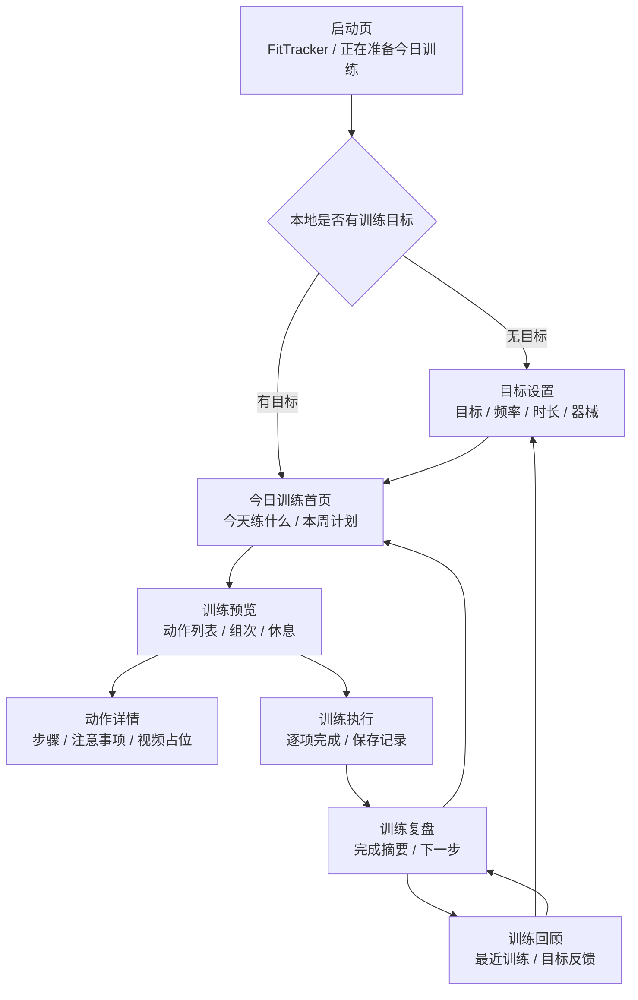
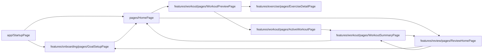

# FitTracker 目标训练闭环原型图

**版本：** MVP 收口版  
**日期：** 2026-05-23  
**目标：** 按已跑通链路重排信息层级，首页、预览、执行、复盘、回顾形成单线闭环。

## 1. 信息架构



## 2. MVP 路由地图



## 3. 页面线框

### 3.1 启动页

```text
┌────────────────────────────┐
│                            │
│          FitTracker         │
│      正在准备今日训练        │
│                            │
└────────────────────────────┘
```

目标：不承载业务操作，只负责读取目标并分发路由。

### 3.2 目标设置

```text
┌────────────────────────────┐
│ 训练目标                    │
│ 选择你的当前训练方向          │
│                            │
│ [增肌] [减脂] [力量]         │
│ [塑形] [恢复]                │
│                            │
│ 每周训练： 3 天              │
│ 单次时长： 45 分钟           │
│ 器械条件：哑铃 / 徒手         │
│                            │
│ [保存目标并生成计划]          │
└────────────────────────────┘
```

信息层级：先目标，再训练约束，最后生成计划。

### 3.3 今日训练首页

```text
┌────────────────────────────┐
│ 今日训练                    │
│ 目标驱动的本周训练入口        │
│                            │
│ 本周计划名称                 │
│ [每周 3 天] [单次 45 分钟]   │
│                            │
│ 今天该练                    │
│ Push Day / 上肢推            │
│ 1. 俯卧撑                   │
│ 2. 哑铃肩推                 │
│ 3. 平板支撑                 │
│                            │
│ [开始今日训练]               │
│ [查看训练回顾]               │
│                            │
│ 本周计划                    │
│ 周一  上肢推        今天      │
│ 周三  下肢与核心     计划      │
│ 周五  全身循环       计划      │
└────────────────────────────┘
```

信息层级：今日任务优先，本周计划辅助确认。

### 3.4 训练预览

```text
┌────────────────────────────┐
│ 训练预览                    │
│ 今天训练约 45 分钟           │
│                            │
│ 动作 1：俯卧撑               │
│ 3 组 × 10-12 次   休息 60s   │
│ [查看动作详情]               │
│                            │
│ 动作 2：哑铃肩推             │
│ 3 组 × 8-10 次    休息 90s   │
│ [查看动作详情]               │
│                            │
│ [开始训练]                  │
└────────────────────────────┘
```

信息层级：训练总览、动作执行信息、动作详情。

### 3.5 训练执行

```text
┌────────────────────────────┐
│ 训练执行                    │
│ 上肢推 · 45 分钟             │
│                            │
│ □ 俯卧撑       3 组          │
│ □ 哑铃肩推     3 组          │
│ □ 平板支撑     3 组          │
│                            │
│ 完成 2 / 3                  │
│ [保存并完成训练]             │
└────────────────────────────┘
```

信息层级：完成状态比细节优先，降低执行时认知负担。

### 3.6 训练复盘

```text
┌────────────────────────────┐
│ 训练复盘                    │
│ 本次训练已保存               │
│                            │
│ 完成动作：3 个               │
│ 训练时长：42 分钟            │
│ 训练主题：上肢推             │
│                            │
│ [查看训练回顾]               │
│ [回到今日训练]               │
└────────────────────────────┘
```

信息层级：结果确认、下一步选择。

### 3.7 训练回顾

```text
┌────────────────────────────┐
│ 训练回顾                    │
│ 最近训练与目标反馈            │
│                            │
│ 本周完成：2 / 3 次           │
│ 最近一次：上肢推              │
│                            │
│ 训练记录                    │
│ 05-23  上肢推   已完成        │
│ 05-21  下肢核心 已完成        │
│                            │
│ [查看最近复盘]               │
│ [调整训练目标]               │
└────────────────────────────┘
```

信息层级：先反馈，再记录，再调整目标。

## 4. 导航收口原则

- 首页只保留“开始今日训练”和“查看训练回顾”两个主入口。
- 动作库在 MVP 中只通过训练预览进入动作详情，不单独暴露动作库首页。
- 个人中心、内容同步、肌群覆盖、个人记录等页面不进入当前主路由。
- 目标调整从回顾页进入，避免用户在训练前频繁改目标。
- 复盘页提供回首页和看回顾两个方向，闭合训练结束后的自然路径。
