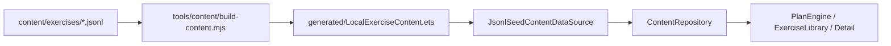

# FitTracker 内容仓库适配与本地数据库表设计

## 目标

当前阶段不直接替换 `content/exercises/*.jsonl`。JSONL 继续作为人工维护的种子源，并由 `tools/content/build-content.mjs` 在构建前完成校验与 ArkTS 模块生成。应用侧通过 `ContentRepository` 读取统一的 `ContentDataSource` 适配接口，后续可以把 JSONL 种子导入本地数据库，再新增数据库数据源实现。

## 当前读取链路



## 适配接口约定

`ContentDataSource` 是内容源边界，当前实现为 `JsonlSeedContentDataSource`。

- `getSourceInfo()`：返回内容源标识、是否数据库驱动、是否依赖构建期校验。
- `getMuscles()`：返回肌群种子数据。
- `getEquipment()`：返回器械种子数据。
- `getExercises()`：返回动作种子数据。

后续数据库落地时新增 `DatabaseContentDataSource`，保持 `ContentRepository` 对外 API 不变。

当前启动页会先尝试加载本地数据库内容；如果本地库不存在或读取失败，仍会回退到 JSONL 种子源，并可通过 `ContentDatabaseService.importSeedAndUseDatabase(context)` 重新导入后切换数据源。

## MVP 表结构

### `exercises`

| 字段 | 类型 | 必填 | 说明 |
| --- | --- | --- | --- |
| `exercise_id` | text | 是 | 动作 ID，对应当前 JSONL 的 `exerciseId` |
| `name_zh` | text | 是 | 中文名称 |
| `name_en` | text | 是 | 英文名称 |
| `aliases_json` | text | 是 | 别名 JSON 数组 |
| `difficulty` | text | 是 | `beginner` / `intermediate` / `advanced` |
| `goal_tags_json` | text | 是 | 目标标签 JSON 数组 |
| `steps_json` | text | 是 | 步骤 JSON 数组 |
| `cues_json` | text | 是 | 提示 JSON 数组 |
| `common_mistakes_json` | text | 是 | 常见错误 JSON 数组 |
| `safety_notes_json` | text | 是 | 安全提示 JSON 数组 |
| `content_version` | integer | 是 | 内容版本 |
| `status` | text | 是 | `draft` / `reviewed` / `published` |
| `created_at` | integer | 是 | 创建时间戳 |
| `updated_at` | integer | 是 | 更新时间戳 |

### `muscles`

| 字段 | 类型 | 必填 | 说明 |
| --- | --- | --- | --- |
| `muscle_id` | text | 是 | 肌群 ID |
| `name_zh` | text | 是 | 中文名称 |
| `region` | text | 是 | 区域，如 `upper` / `lower` / `core` |

### `equipment`

| 字段 | 类型 | 必填 | 说明 |
| --- | --- | --- | --- |
| `equipment_id` | text | 是 | 器械 ID |
| `name_zh` | text | 是 | 中文名称 |
| `category` | text | 否 | 器械类型，如 `bodyweight` / `free_weight` / `machine` / `band` |

### `exercise_muscles`

| 字段 | 类型 | 必填 | 说明 |
| --- | --- | --- | --- |
| `exercise_id` | text | 是 | 关联动作 |
| `muscle_id` | text | 是 | 关联肌群 |
| `role` | text | 是 | `primary` / `secondary` |
| `sort_order` | integer | 是 | 展示和导出顺序 |

### `exercise_equipment`

| 字段 | 类型 | 必填 | 说明 |
| --- | --- | --- | --- |
| `exercise_id` | text | 是 | 关联动作 |
| `equipment_id` | text | 是 | 关联器械 |
| `is_required` | integer | 是 | 0 或 1 |
| `sort_order` | integer | 是 | 展示和导出顺序 |

### `exercise_alternatives`

| 字段 | 类型 | 必填 | 说明 |
| --- | --- | --- | --- |
| `exercise_id` | text | 是 | 原动作 |
| `alternative_exercise_id` | text | 是 | 替代动作 |
| `reason` | text | 否 | 替代原因，如器械不足、难度降低 |
| `sort_order` | integer | 是 | 推荐顺序 |

### `exercise_media`

| 字段 | 类型 | 必填 | 说明 |
| --- | --- | --- | --- |
| `media_id` | text | 是 | 媒体 ID |
| `exercise_id` | text | 是 | 关联动作 |
| `media_type` | text | 是 | `video` / `cover` |
| `uri` | text | 是 | `local://`、应用内路径或自建资源地址 |
| `thumbnail_uri` | text | 否 | 缩略图路径 |
| `view_angle` | text | 否 | `front` / `side` / `three_quarter` / `detail` |
| `duration_seconds` | integer | 否 | 视频时长 |
| `license_type` | text | 是 | `owned` / `licensed` / `open_license` |
| `source_note` | text | 是 | 来源和授权说明 |
| `checksum` | text | 否 | 文件校验值 |
| `sort_order` | integer | 是 | 展示顺序 |

## 导入约束

- JSONL 仍是初始种子源，不接入 MuscleWiki 官方 API，不抓取页面数据、图片、视频或文案。
- 导入脚本必须先复用构建期校验规则，校验通过后才能写入本地数据库。
- 数据库导入后仍保留 `node tools/content/build-content.mjs`，用于阻止脏 JSONL 进入应用。
- 媒体字段只能使用本地占位、自制资源、授权资源或自建资源路径。

## 种子 SQL 导出

当前提供最小导出脚本：

```powershell
node tools/content/export-db-seed.mjs
```

脚本流程：

1. 先运行 `node tools/content/build-content.mjs`，复用 JSONL 格式、引用、覆盖率和本地媒体校验。
2. 校验通过后读取 `content/exercises/*.jsonl`。
3. 生成 `build/content/fittracker-content-seed.sql`，包含 MVP 表结构和 `INSERT` 数据。

应用侧当前默认使用 `JsonlSeedContentDataSource`。后续接入真实本地数据库读取时，新增数据库加载流程后切换到 `DatabaseContentDataSource`，`ContentRepository` 外部调用保持不变。

## ArkTS 侧导入

`ContentDatabaseService` 提供当前最小数据库落地入口：

- `importSeedAndUseDatabase(context)`：打开 `fittracker_content.db`，建表，清空旧内容，将当前 JSONL 生成内容导入 RDB，然后把 `ContentRepository` 切到 `DatabaseContentDataSource`。
- `loadDatabaseAndUse(context)`：读取已存在的 RDB 内容，读到动作后切换 `ContentRepository`，否则保持 JSONL 种子源。

当前默认启动路径仍使用 JSONL 种子源。等模拟器视觉回归稳定后，再决定是否在启动阶段自动调用数据库导入。

## Phase 4 内容同步基础边界

Phase 4 第一版内容同步不直接改动 `ContentRepository` 的对外读取 API，而是在现有本地数据库导入链路上新增“远端整包导入”能力：

- `SyncService` 负责 manifest 检查、版本比较、元信息持久化和失败状态记录
- `ContentDatabaseService` 负责把校验通过的内容包导入 `fittracker_content.db`
- `ContentRepository` 继续只暴露统一读取接口，导入成功后切换到 `DatabaseContentDataSource`
- 导入失败时保持旧数据库源；旧库不可用时回退 `JsonlSeedContentDataSource`

内容同步基础的最小模型与流程约定见：[content-sync-foundation.md](./content-sync-foundation.md)。
