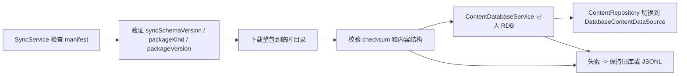

# FitTracker Phase 4 内容同步基础设计

更新时间：2026-06-06

## 目标

本轮只定义 Phase 4 内容同步基础的最小落地范围，为后续实现这条链路做准备：

1. 检查远端 manifest
2. 下载并导入整包内容
3. 导入失败时回退到本地旧库或 JSONL 种子源

这份设计故意不碰页面层，也不引入账号体系、用户数据云同步、媒体缓存或增量 diff。

## 非目标

- 不做训练记录、计划、目标等用户数据同步
- 不做视频缓存、离线媒体包或 CDN 策略
- 不做增量 patch / diff 包
- 不做正式后端 API 细节约定，只定义应用侧最小消费契约

## 最小同步范围

Phase 4 第一版只同步动作内容包，包含：

- 肌群
- 器械
- 动作主体
- 动作媒体元数据引用

不直接同步：

- 视频或封面二进制缓存
- 用户训练数据
- 草稿、回顾衍生统计、数据库运行时缓存

## 运行时最小模型

本轮先在 shared model 里补齐 3 个最小模型。

### 1. `ContentSyncManifest`

用于表示一次可下载内容包的远端声明：

- `syncSchemaVersion`：同步协议版本，当前固定从 `1` 起步
- `packageKind`：当前第一版只接受 `full`
- `packageVersion`：内容包版本号，必须大于本地版本才有更新意义
- `packageUrl`：内容包下载地址
- `packageChecksum`：包校验值
- `packageSizeBytes`：包体积，用于下载前判断
- `generatedAt`：包生成时间
- `exerciseCount`：内容统计，用于导入后自检
- `releaseChannel`：例如 `stable` / `internal`
- `sourceNote`：来源说明或发布备注

### 2. `ContentSyncMetadata`

用于本地持久化同步元信息：

- `syncSchemaVersion`
- `localVersion`
- `lastKnownRemoteVersion`
- `lastCheckedAt`
- `lastSyncAttemptAt`
- `lastAppliedAt`
- `activeSourceId`
- `fallbackSourceId`
- `status`
- `failureReason`

### 3. `ContentSyncStatus`

用于运行时给上层消费的状态快照，在原有最小结构上补齐：

- 当前激活源 `activeSourceId` / `activeSourceName`
- 回退源 `fallbackSourceId`
- 最近同步尝试时间
- 最近应用成功时间
- 失败原因

## manifest 样例

```json
{
  "syncSchemaVersion": 1,
  "packageKind": "full",
  "packageVersion": 3,
  "packageUrl": "https://content.fittracker.example/packages/content-v3.zip",
  "packageChecksum": "sha256:abcdef",
  "packageSizeBytes": 245760,
  "generatedAt": 1780704000000,
  "exerciseCount": 80,
  "releaseChannel": "stable",
  "sourceNote": "2026-06 动作库修订"
}
```

## 本地元信息样例

```json
{
  "syncSchemaVersion": 1,
  "localVersion": 2,
  "lastKnownRemoteVersion": 3,
  "lastCheckedAt": 1780707600000,
  "lastSyncAttemptAt": 1780707660000,
  "lastAppliedAt": 1780707720000,
  "activeSourceId": "local_database",
  "fallbackSourceId": "jsonl_seed",
  "status": "sync_applied",
  "failureReason": ""
}
```

## 最小导入链路



第一版接受的失败策略：

1. manifest 不兼容：直接拒绝应用，保持当前内容源
2. 下载失败：保持当前内容源
3. 导入失败：保持旧数据库源；若旧数据库不可用，再回退 JSONL
4. 导入后 exercise 数量异常：视为失败，不切源

## 建议的后续编码顺序

### A. SyncService 实现者

适合先接：

- manifest 拉取
- manifest 校验
- 本地 `ContentSyncMetadata` 读写
- “是否需要应用新包”的判定逻辑

### B. ContentDatabaseService / Repository 实现者

适合接：

- 从内容包目录导入数据库
- 导入后内容数量与版本自检
- 导入失败后的回退与不切源策略

### C. 工具链实现者

适合接：

- 内容包产物格式
- manifest 生成脚本
- checksum 生成与本地验收脚本

## 文件边界

本轮设计对应的实现边界固定为：

- `entry/src/main/ets/shared/models/TrainingModels.ets`
- `entry/src/main/ets/shared/services/SyncService.ets`
- `entry/src/main/ets/shared/services/ContentDatabaseService.ets`
- `entry/src/main/ets/shared/services/ContentRepository.ets`
- `content/**`
- `tools/content/**`

页面层这轮仍然不动；后续如果需要内容同步入口页或设置项，再由产品/页面职责方接入。
