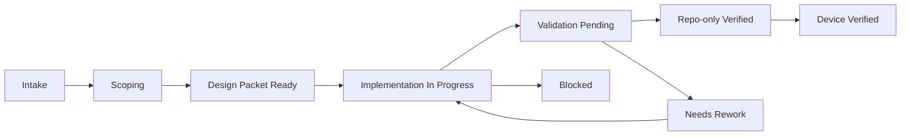
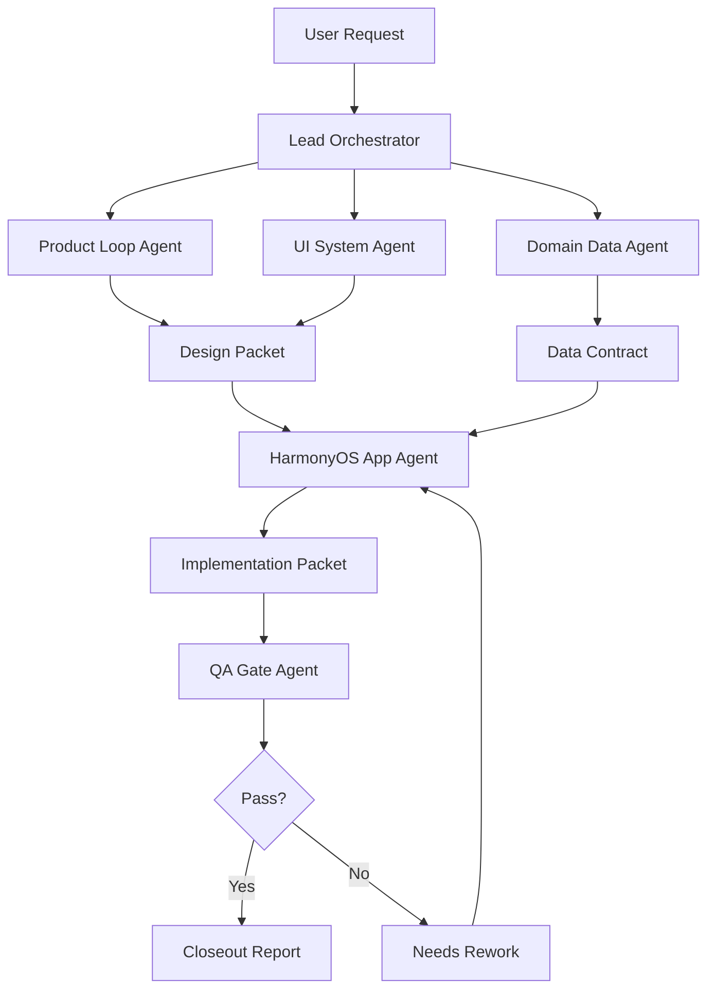

# FitTracker HandoffKit-Ready 多智能体消息系统设计

Last updated: 2026-06-19

## 1. 目标

为 FitTracker 设计一套**基于消息传递**的多智能体系统，用于持续交付这个项目，而不是做一个泛用 demo。系统必须围绕当前仓库的真实约束来设计：

- 本地优先，无后端
- HarmonyOS ArkTS / ArkUI 严格模式
- 主闭环不可破坏
  - 目标设置 -> 首页 -> 训练预览 -> 训练执行 -> 训练复盘 -> 训练回顾 -> 调整目标
- 数据可信是硬门槛
  - 会话保存
  - 持久化与回读
  - 热身组 / 正式组区分
  - PR 计算
  - 周统计 / 热力图 / 历史回顾一致
- 视觉方向固定为 Cold Emerald Performance

这意味着这套多智能体系统的首要职责不是“并行改代码”，而是：

1. 把任务拆成不会互相踩文件边界的工作包。
2. 用消息包而不是共享上下文来传递责任。
3. 在每次交接时显式携带验证要求与不可破坏项。
4. 让 UI、数据、验证三条线能并行，但最终由主控收口。

## 2. 设计原则

### 2.1 为什么必须用消息传递

FitTracker 当前最容易出问题的不是“不会写页面”，而是以下几类交叉风险：

- 页面改漂亮了，但训练语义漂移了
- 数据层修了，但回顾页展示口径没同步
- 一个页面组在改，另一个 agent 同时碰相邻文件，最后结构撕裂
- 验证没有被当成独立责任，导致“看起来合理”的提交混进主链路

所以系统采用**消息传递 + 单包责任 + 单写者规则**：

- agent 之间不共享“随手改到一半”的工作状态
- agent 之间只交换结构化消息
- 同一时刻一个文件组只允许一个写者
- 任何 handoff 都必须携带：
  - 当前事实
  - 改动边界
  - 风险边界
  - 验证要求

### 2.2 本项目的系统目标

这套系统要长期服务于三类任务：

- 用户可见页面升级
- 数据语义与服务层修复
- closeout / 验收 / 回归控制

因此它不是“自由聊天式”多 agent，而是**受约束的交付系统**。

## 3. Agent 拓扑

建议采用 1 个主控 agent + 6 个专业 agent 的结构。

### 3.1 Lead Orchestrator / 主控调度

职责：

- 接收用户意图
- 识别任务类型
- 生成工作包
- 路由消息
- 控制文件写入边界
- 合并结论
- 决定最终验证链

只读范围：

- 全仓库

写入范围：

- 不直接承担大规模实现
- 只写任务包、汇总文档、最终收口小修

### 3.2 Product Loop Agent / 产品闭环 agent

职责：

- 维护主闭环完整性
- 审核页面是否真的服务训练任务，而不是装饰页面
- 判断主 CTA、状态层级、路径顺序是否正确

重点关注：

- `PencilHomePage`
- `PencilPreviewPage`
- `PencilActivePage`
- `WorkoutSummaryPage`
- `PencilReviewPage`

### 3.3 UI System Agent / 视觉与设计系统 agent

职责：

- 收口视觉语言
- 保证页面之间属于同一产品
- 推进 token / card / button / header / metric tile 的统一

重点写入范围：

- `entry/src/main/ets/common/styles/DesignTokens.ets`
- `entry/src/main/ets/components/`
- 关键页面的呈现层

### 3.4 Domain Data Agent / 训练语义与数据 agent

职责：

- 守住训练语义
- 维护统计口径
- 审核热身组与正式组边界
- 维护 PR / 周统计 / 热力图 / 回顾页一致性

重点写入范围：

- `entry/src/main/ets/shared/services/`
- `entry/src/main/ets/common/services/WorkoutSessionService.ets`
- `entry/src/main/ets/features/workout/services/`

### 3.5 HarmonyOS App Agent / ArkUI 实现 agent

职责：

- 将产品包和 UI 包实现到 ArkTS / ArkUI
- 处理页面结构、组件组合、导航与状态接线
- 负责 ArkTS 严格模式兼容

重点写入范围：

- `entry/src/main/ets/app/`
- `entry/src/main/ets/features/**/`
- 受控地写入 `components/`

### 3.6 QA Gate Agent / 验证与回归 agent

职责：

- 为每个工作包生成最短验证链
- 检查是否满足 repo-only 证据
- 标记 device-side 缺口
- 专注找破坏闭环和数据可信的风险

输出：

- 构建结果
- 风险列表
- 未验证项
- blocker

### 3.7 Knowledge Curator Agent / 知识沉淀 agent

职责：

- 将关键设计、边界、回归经验沉淀到 docs
- 把“为什么这样改”保存下来
- 为后续 handoff 降低上下文成本

重点写入范围：

- `docs/`

## 4. 消息总线模型

### 4.1 主题（topics）

建议使用以下主题，而不是自由广播：

- `intake.task`
- `analysis.findings`
- `design.packet`
- `implementation.packet`
- `data.contract`
- `validation.request`
- `validation.result`
- `risk.alert`
- `closeout.report`
- `blocked.request`

### 4.2 消息信封

所有消息统一使用一个 envelope，避免口头交接。

```json
{
  "messageId": "msg_20260619_001",
  "threadId": "fittracker-main",
  "workItemId": "wi_review_lane_refactor_01",
  "topic": "design.packet",
  "from": "product_loop_agent",
  "to": "harmonyos_app_agent",
  "priority": "high",
  "createdAt": "2026-06-19T14:30:00+08:00",
  "requiresAck": true,
  "payload": {},
  "artifacts": [],
  "constraints": [],
  "acceptance": [],
  "risks": []
}
```

### 4.3 FitTracker 必带字段

对这个项目，`payload` 之外还必须带这些字段：

- `routeScope`
  - 例如 `["home", "preview", "active"]`
- `fileScope`
  - 实际允许写入的文件
- `doNotBreak`
  - 不可破坏项列表
- `validationLevel`
  - `repo_only` / `device_required`
- `dataContractsTouched`
  - 例如 `["completedSets excludes warmups", "heatmap uses actual session data"]`

## 5. 标准消息类型

### 5.1 Task Intake

用户请求进入系统后的第一种消息。

```json
{
  "topic": "intake.task",
  "payload": {
    "userIntent": "提升 PencilReviewPage 的长期趋势分析体验",
    "taskType": "user_visible_route_upgrade",
    "routeScope": ["review"],
    "riskLevel": "high"
  },
  "constraints": [
    "不能破坏训练回顾与底层数据一致性",
    "必须保持简体中文文案",
    "保持 Cold Emerald Performance 方向"
  ]
}
```

### 5.2 Design Packet

由 Product Loop Agent 或 UI System Agent 产出，交给实现 agent。

必须包括：

- 页面目标
- 用户应该更容易完成什么
- 层级变化
- 不能破坏什么
- 哪些文件可改

### 5.3 Data Contract

由 Domain Data Agent 发出，用来约束任何用户可见改动。

示例：

```json
{
  "topic": "data.contract",
  "payload": {
    "contracts": [
      "热身组持久化保存，但不计入正式组完成率",
      "训练量只统计正式组",
      "PR 计算基于实际记录组",
      "Review / Stats / Summary 口径一致"
    ]
  }
}
```

### 5.4 Implementation Packet

由 HarmonyOS App Agent 产出，交给 QA Gate Agent 或主控。

必须包括：

- 实际改动文件
- 实现说明
- 尚未验证项
- 怀疑风险

### 5.5 Validation Result

QA Gate Agent 统一输出。

必须包括：

- `repo-only 已验证`
- `device-side 已验证`
- `blocker`

这三个字段在 FitTracker 里是强制的，不能省略。

## 6. 工作项状态机

每个 work item 建议遵循以下状态：



### 6.1 状态解释

- `Intake`
  - 用户需求进入
- `Scoping`
  - 主控划定文件边界与专业边界
- `Design Packet Ready`
  - 产品 / 视觉 / 数据约束已明确
- `Implementation In Progress`
  - 指定单写者改动
- `Validation Pending`
  - 等待验证
- `Repo-only Verified`
  - 构建、测试、静态证据成立
- `Device Verified`
  - 真实设备链路验证完成
- `Needs Rework`
  - 验证失败但不构成 blocker
- `Blocked`
  - 需要外部条件或用户决策

## 7. 单写者规则

这是这套系统最关键的安全机制。

### 7.1 文件组锁

同一时刻只允许一个 agent 持有某个文件组的写锁。

建议的锁粒度：

- `ui_home_loop`
- `PencilHomePage.ets`
- `PencilPreviewPage.ets`
- `PencilActivePage.ets`
  - `WorkoutSummaryPage.ets`
- `ui_review_loop`
- `PencilReviewPage.ets`
  - `ExerciseDetailPage.ets`
- `design_system_core`
  - `DesignTokens.ets`
  - `components/*`
- `domain_training_data`
  - `shared/services/*`
  - `common/services/WorkoutSessionService.ets`
- `validation_chain`
  - `entry/src/ohosTest/ets/test/*`
  - `tools/*`

### 7.2 锁申请消息

```json
{
  "topic": "implementation.packet",
  "payload": {
    "lockRequest": {
      "lockId": "ui_home_loop",
      "reason": "收口训练预览与训练执行的连续体验",
      "expectedDuration": "1 turn"
    }
  }
}
```

主控批准后，其他 agent 只能读，不能写这组文件。

## 8. FitTracker 专用角色路由

### 8.1 页面可见改动

默认路由：

1. Lead Orchestrator
2. Product Loop Agent
3. UI System Agent
4. Domain Data Agent
5. HarmonyOS App Agent
6. QA Gate Agent

原因：

- 页面在这个项目里永远不能脱离数据语义单独改

### 8.2 数据层改动

默认路由：

1. Lead Orchestrator
2. Domain Data Agent
3. HarmonyOS App Agent
4. QA Gate Agent

必要时追加：

- Knowledge Curator Agent

### 8.3 closeout / 验收

默认路由：

1. Lead Orchestrator
2. QA Gate Agent
3. Product Loop Agent
4. Knowledge Curator Agent

## 9. 三条核心消息链

### 9.1 UI 主链路升级链

适用任务：

- 首页重构
- 训练预览升级
- 执行页控制台化
- 复盘页高级化



### 9.2 数据可信修复链

适用任务：

- 热身组 / 正式组逻辑
- PR 统计口径
- Review / Summary / Stats 对齐

流程重点：

- Domain Data Agent 先出 contract
- App Agent 只按 contract 实现
- QA Gate Agent 用对口验证链回查所有消费页

### 9.3 回归救火链

适用任务：

- 页面结构损坏
- 构建突然失败
- 局部 refactor 把主链路撕裂

规则：

1. 先冻结大任务
2. 主控只发 recovery work item
3. App Agent 单独持锁修复
4. QA Gate Agent 先跑最短构建链
5. 验证恢复后才回原任务

## 10. 核心消息包模板

### 10.1 设计包模板

```json
{
  "topic": "design.packet",
  "payload": {
    "pageGoal": "训练复盘页像结果摘要卡，而不是确认页",
    "userShouldFeel": [
      "刚完成一轮高质量训练",
      "结果可信",
      "下一步很明确"
    ],
    "hierarchyChanges": [
      "先看结果摘要",
      "再看数据对齐",
      "再看 PR 亮点",
      "最后处理修正和下一步"
    ]
  },
  "fileScope": [
    "entry/src/main/ets/features/workout/pages/WorkoutSummaryPage.ets"
  ],
  "doNotBreak": [
    "热身组与正式组口径",
    "sessionId 路由回读",
    "编辑/撤销/恢复链路"
  ]
}
```

### 10.2 验证包模板

```json
{
  "topic": "validation.request",
  "payload": {
    "buildTargets": [
      "entry@default",
      "entry@ohosTest"
    ],
    "smokeChecks": [
      "路由仍可进入复盘页",
      "无 session 状态可恢复",
      "编辑与撤销入口仍在"
    ]
  }
}
```

## 11. 与当前仓库的边界映射

### 11.1 页面边界

- `features/pencil/`
  - 当前视觉主线入口
- `features/onboarding/`
  - 目标设置
- `features/workout/`
  - 预览 / 执行 / 复盘
- `features/review/`
  - 回顾 / 趋势 / 调整
- `features/exercise/`
  - 动作详情

### 11.2 服务边界

- `shared/services/`
  - 推荐作为训练语义与跨页口径中心
- `common/services/`
  - 推荐保留基础存储与 app 级服务

### 11.3 文档边界

- `docs/agent-team-fittracker-overlay.md`
  - 团队路由 overlay
- `docs/ui-design-review-packet.md`
  - UI 设计判断基准
- 本文档
  - handoffkit-ready 消息系统设计

## 12. 一个真实任务的消息流示例

任务：

> 把 `PencilActivePage` 从“表单感”改造成“记录控制台”，同时不能破坏热身组语义。

### 步骤

1. 主控发 `intake.task`
   - 标记 `routeScope=["active"]`
   - 标记 `riskLevel="high"`

2. Product Loop Agent 回 `design.packet`
   - 指出当前动作、当前组、输入区、下一步必须强层级

3. UI System Agent 回 `design.packet`
   - 指出绿色只用于当前激活、完成、关键 CTA

4. Domain Data Agent 回 `data.contract`
   - 热身组保存但不计入完成率 / PR / 训练量

5. HarmonyOS App Agent 申请 `ui_home_loop` 写锁
   - 改 `PencilActivePage.ets`
   - 必要时补组件

6. QA Gate Agent 发 `validation.result`
   - `entry@default`
   - `entry@ohosTest`
   - focused smoke notes

7. 主控发 `closeout.report`
   - 汇总 repo-only 与 device-side 状态

## 13. 推荐的执行策略

### Phase 1：消息化但不自动化

先不接真正的 handoffkit runtime，只按这份协议做人类可读消息包。

收益：

- 成本低
- 立刻减少任务漂移
- 立刻减少“多人同时碰同一页”的风险

### Phase 2：半自动路由

接一个简单编排层，让主控按任务类型自动生成：

- 角色路由
- 文件锁
- 验证请求

### Phase 3：接入 handoffkit

等 handoffkit 插件可用后，把下面三部分映射进去：

- agent registry
- topic routing
- lock / ack / result protocol

届时只需要做实现映射，不需要重新设计系统。

## 14. 不该做的事

这套系统必须明确避免：

- 多个 agent 同时改同一文件组
- 把“看起来合理”当作验证通过
- 让 UI agent 单独决定数据口径
- 让数据 agent 单独决定页面层级
- 不带验证约束就直接 handoff
- 不区分 repo-only 与 device-side

## 15. 结论

FitTracker 适合的不是“人人都能随便改”的多智能体系统，而是：

- **主控调度**
- **专业角色分包**
- **消息包传递**
- **单写者文件锁**
- **显式数据契约**
- **显式验证回执**

如果后续要把这套设计接回 handoffkit，建议优先落地的不是 agent 数量，而是下面四个能力：

1. work item 消息信封
2. 文件组锁
3. data contract 消息
4. validation result 回执

这四个能力一旦到位，FitTracker 的多智能体交付会明显比“共享上下文 + 临场协作”稳定得多。
