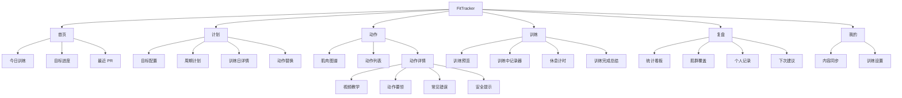

# FitTracker 目标训练闭环原型图

版本：V2.0
日期：2026-05-23

## 1. 产品主流程图


## 2. 信息架构图



## 3. 首次使用线框图

```text
┌──────────────────────────────┐
│ FitTracker                    │
│ 按目标生成训练计划，记录进步      │
│                              │
│ [开始配置目标]                 │
│ [稍后再说，使用默认计划]          │
└──────────────────────────────┘

┌──────────────────────────────┐
│ 你的训练目标是什么？             │
│                              │
│ [增肌] [减脂]                  │
│ [力量] [体态改善]               │
│                              │
│ 训练水平 / 每周天数 / 单次时长     │
│ 可用器械 / 受限部位              │
│                              │
│ [下一步]                       │
└──────────────────────────────┘

┌──────────────────────────────┐
│ 已为你生成 4 周增肌计划           │
│                              │
│ 周一 胸 + 肩 + 三头  60 分钟      │
│ 周三 背 + 二头       60 分钟      │
│ 周五 腿 + 核心       60 分钟      │
│                              │
│ [使用此计划] [重新配置]           │
└──────────────────────────────┘
```

## 4. 首页线框图

```text
┌──────────────────────────────┐
│ 今天练什么                     │
│ 目标：增肌 · 第 1 周             │
├──────────────────────────────┤
│ 今日训练                       │
│ 胸 + 肩 + 三头 · 6 个动作         │
│ 预计 60 分钟                    │
│ [开始训练]                      │
├──────────────────────────────┤
│ 本周进度  1 / 3 次               │
│ ███████░░░                     │
├──────────────────────────────┤
│ 最近 PR                        │
│ 杠铃卧推 估算 1RM 82.5kg         │
├──────────────────────────────┤
│ 首页 | 计划 | 动作 | 训练 | 复盘    │
└──────────────────────────────┘
```

## 5. 计划页线框图

```text
┌──────────────────────────────┐
│ 当前计划：4 周增肌基础           │
│ [重新生成] [编辑目标]             │
├──────────────────────────────┤
│ 周一 胸 + 肩 + 三头              │
│ 卧推 / 上斜哑铃推 / 侧平举 ...    │
│ [查看详情]                       │
├──────────────────────────────┤
│ 周三 背 + 二头                   │
│ 引体 / 划船 / 面拉 ...            │
│ [查看详情]                       │
├──────────────────────────────┤
│ 周五 腿 + 核心                   │
│ 深蹲 / 腿举 / 平板支撑 ...        │
│ [查看详情]                       │
└──────────────────────────────┘
```

## 6. 动作百科线框图

```text
┌──────────────────────────────┐
│ 动作百科                       │
│ [搜索动作、肌群、器械]            │
├──────────────────────────────┤
│ 肌肉图谱                        │
│ [正面/背面人体肌群图区域]          │
├──────────────────────────────┤
│ 胸  背  腿  肩  手臂  核心         │
├──────────────────────────────┤
│ 杠铃卧推                        │
│ 胸 · 杠铃 · 中级                 │
│ [详情]                          │
└──────────────────────────────┘
```

## 7. 动作详情线框图

```text
┌──────────────────────────────┐
│ 杠铃卧推                       │
│ 胸 · 三头 · 肩前束               │
├──────────────────────────────┤
│ [视频教学区域]                   │
├──────────────────────────────┤
│ 步骤 | 要领 | 错误 | 安全 | 替代    │
│ 1. 肩胛后缩，下沉稳定             │
│ 2. 杠铃下降到胸中下部             │
│ 3. 推起时保持手腕中立             │
├──────────────────────────────┤
│ 我的记录：估算 1RM 82.5kg         │
│ [加入计划] [替换当前动作]          │
└──────────────────────────────┘
```

## 8. 训练中线框图

```text
┌──────────────────────────────┐
│ 00:28:42       胸 + 肩 + 三头     │
├──────────────────────────────┤
│ 当前动作：杠铃卧推                │
│ [视频缩略图] [查看要领]            │
├──────────────────────────────┤
│ 组  重量   次数   RPE   状态       │
│ 1   60kg   10     7     ✓         │
│ 2   65kg   8      8     ✓         │
│ 3   __     __     __    ○         │
│ [添加组]                          │
├──────────────────────────────┤
│ 休息 01:30                       │
│ [替换动作] [结束训练]              │
└──────────────────────────────┘
```

## 9. 复盘线框图

```text
┌──────────────────────────────┐
│ 本次训练完成                    │
│ 完成率 92% · 总容量 6,840kg      │
│ 新 PR：杠铃卧推                  │
├──────────────────────────────┤
│ 肌群覆盖                        │
│ 胸 ████████                     │
│ 肩 █████                        │
│ 三头 ████                       │
├──────────────────────────────┤
│ 下次建议                        │
│ 卧推保持当前重量，增加 1 组热身。   │
│ 肩部疲劳偏高，下次侧平举降重。      │
├──────────────────────────────┤
│ [查看详细复盘] [返回首页]          │
└──────────────────────────────┘
```

## 10. 内容同步线框图

```text
┌──────────────────────────────┐
│ 内容库                         │
│ 当前版本：2026.05.23.seed       │
│ 上次更新：尚未同步               │
├──────────────────────────────┤
│ 动作库       可用                │
│ 视频内容     部分占位             │
│ 计划规则     可用                │
├──────────────────────────────┤
│ [检查更新]                      │
│ 网络失败时继续使用本地内容。        │
└──────────────────────────────┘
```
