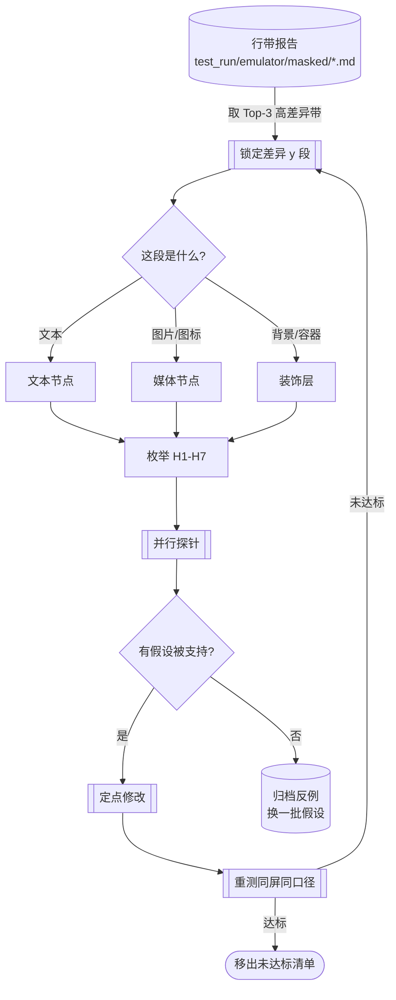

# 还原收敛的「发散探索」工作流

> 面向：接手「HTML 原型 → ArkUI 1:1 还原」收尾工作的 agent/开发者。
> 目标：把「看行带 → 猜一个原因 → 改 → 重测」的串行试错，
> 升级为「按差异区段发散假设 → 并行探针证伪 → 收敛」的工作流。

## 1. 为什么需要这份流程

串行诊断慢在三处：

1. **假设不枚举** —— 一次只想一个原因，猜错整轮浪费
2. **证据不自动** —— 坐标/尺寸这类可机读的量，此前靠人工读源码比对
3. **结论不沉淀** —— 已证伪的假设散落在多个文档，容易重复探索

## 2. 四步流程



**第 1 步 · 定位**：读该屏的 `test_run/emulator/masked/<屏>.md`，取 Top-3 行带，
换算成屏幕绝对 y（`报告 y + 100`）。**先看形状**：单峰集中 / 双峰 / 平坦 —— 形状本身是线索。

**第 2 步 · 归属**：用 `devecocli ui layout --format json` 列该 y 段的元素与文本，判断是文本、媒体还是装饰层。

**第 3 步 · 发散**：对归属的元素，逐条过下面七类假设（H1–H7）。

**第 4 步 · 收敛**：跑探针（可并行），采信被支持的、归档被证伪的。

## 3. 假设空间（H1–H7）

| # | 假设 | 判据 / 探针 | 典型反例（已在本项目出现过） |
|---|---|---|---|
| **H1** | **实现自加元素** | grep 该段元素的 `Gradient` / `backgroundColor('#`，逐个问「原型里有吗」；对照原型 CSS 的 `background` | welcome 的 `radialGradient(center [77.4,108])` 原型没有 → 清掉后 band0 从 44.91% 降到 0.94% |
| **H2** | **坐标偏移** | `python tools/spec-bounds-diff.py --html <原型> --scale <缩放> --crop 100 --pair ".sel=设备文本"` | login 整体偏大约 10%（缺 scale 容器，非逐元素偏移） |
| **H3** | **尺寸不符** | 同上（看 width/height 两行） | welcome 的视觉卡曾同时存在 382×208 与 347×189 两层，后者是重复卡片 |
| **H4** | **字体度量差** | 比对字号/行高/字重；注意原型可能写 `line-height: 1.3` 而实现写成 `0.98*42` | welcome headline 曾用 `0.98*42`，原型是 `1.3` |
| **H5** | **资源差异** | 字节级比对（如 `md5sum`），**不要只看数量** | 「library 20 张 GIF 不同源」被证伪：23 个里 18 个 md5 相同 |
| **H6** | **数据差** | 比对设备上的实际文本 vs 原型静态示例 | home 的「0 次 vs 3/5 次」来自种子数据，非还原缺陷 |
| **H7** | **测量口径** | 掩蔽实验：把可疑区域加入 `--ignore-rect` 后看数字是否骤降 | library 26.82% → 掩蔽 GIF 区后 7.35%：动画帧不同步，非还原缺陷 |

**七类的优先级建议**：H7 → H6 → H5 → H1 → H2/H3 → H4。
理由：前四类一旦成立，会把「不是问题」误判成「问题」，白费后面所有诊断。

## 4. 工具

| 工具 | 用途 | 关键参数 |
|---|---|---|
| `tools/spec-bounds-diff.py` | 原型 CSS 声明值 vs 设备 bounds 对拍（H2/H3） | `--html` `--scale` `--crop` `--pair ".sel=文本"` `--layout`（可选，用已存 json） |
| `tools/scroll-assert.py` | 滚动边界断言；`--probe` 先判断本屏能否滚 | `--probe` / `--fixed` / `--scrolled` / `--swipe` |
| `tools/visual-diff/compare.py` | 像素对比，出行带表 | `--crop` `--ignore-rect`（可重复）`--bands` |
| `tools/visual-diff/render-prototype.py` | 渲染原型参照帧 | `<html> <out> --screen <n>` |
| `devecocli ui layout` | 取设备节点树 | `--format json` `--depth 10`（**8 常常不够**） |

### 两个必须知道的坑

**① bounds 有两种格式**：`devecocli ui layout --format json` 是数组 `[x0,y0,x1,y1]`；
`uitest dumpLayout` 是字符串 `"[x0,y0][x1,y1]"`。项目内两种并存，
`spec-bounds-diff.py` 已兼容，自写脚本时注意。

**② 容器选择器 ≠ 文本节点**：`spec-bounds-diff.py` 比对的是**设备上的文本节点**。
若用容器选择器（如 `.w-logo`）去配它内部的文本（`FITTRACKER`），
差值会包含容器内边距/居中偏移（本例约 11vp），**这是固有偏差、不是缺陷**。
**尽量用文本类选择器**（`.w-eyebrow` / `.w-headline`）配对应文本。

## 5. 结论沉淀格式

每条探索结论按此格式归档（便于后续复用、避免重复探索）：

```text
假设: <一句话>
探针: <用了什么命令/方法>
结论: 支持 / 证伪 / 未定
证据: <文件:行 或 报告路径 或 命令 + 数字>
日期: YYYY-MM-DD
```

**已有的证据库**见 `docs/prototype-migration-wave1-understanding.md` 与
`docs/research-native-ui-restore-tooling.md`；新增结论请追加，不要另起炉灶。

## 6. 并行编排原则

- **按「假设」而非「屏」切分**：同一屏的不同假设可以并行（互不改文件）；
  同一文件的两个修改不能并行（会互相覆盖）。
- **探针优先只读**：H5/H6/H7 的探针都不改代码，可放心并行。
- **单写者**：构建、装 HAP、截图、提交只由主会话执行。
- **子代理产出是待核验假设**：实测中多次出现子代理报告 blocked/salvaged 但结论可用的情况，
  引用前必须自己复核 1–2 条。

## 7. 使用示例（以 review 屏为例）

```text
1. 定位：masked/review.md 的 Top-3 = b6(484-548) 57.95% · b5(420-484) 14.53% · b9(676-740) 9.64%
        → 差异集中在屏幕中下部 484-548，单峰极端集中
2. 归属：layout 列 484-548 段 → 该段是「训练节奏」图表区（b6）
3. 发散（**2026-09-12 实跑**）：
   - H1 `grep Gradient ReviewContent.ets` → **零命中 → 排除**
   - H7 数据差 → **支持**：设备为「待积累 / 0 次 / 0 分钟 / — kg」空态，
     原型为「本周 · 6月 7–13日 / 4 次 / 186 分钟 / -0.8 kg」；
     提示文案也不同（设备「完成一次训练，开始你的复盘。」vs 原型「状态不错，继续保持。」）
   - H2 / H4 → 未跑（H7 已足以解释）
4. 收敛：**H6/H7 成立**。差异带 484–548（crop）对应屏幕 584–648，
   即「训练节奏」柱状图区——设备因数据为 0 而没有柱子，原型有高柱，故形成大面积差异。
   **结论：review 的 11.75% 主要是 seed 数据为空所致，非还原缺陷。**

> 这条结论的推广意义：**先查 H7/H6 再看别的**。
> 凡 seed 下为空态的屏（review / home / complete / preview 都可能），
> 其像素数字里都混有"数据差"成分，需先剥离再谈还原。
```

## 8. 与验收口径的关系

- 达标线仍是**非文本内容区超阈 ≤8%**（`ACCEPTANCE-PLAN.md`）
- **凡含动画媒体的屏**（library 卡片 GIF、active demo、complete confetti），
  比对前先冻结动画或掩蔽媒体区，否则数字失真（已实证）
- 断言滚动语义前，先用 `--probe` 确认该屏能否滚动（3/5 屏不可滚）
