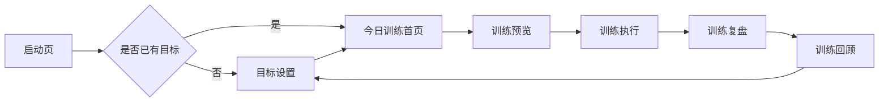

# FitTracker 产品需求文档（PRD）

**版本：** MVP 收口版  
**日期：** 2026-05-23  
**定位：** HarmonyOS 本地优先的目标驱动训练助手  
**核心原则：** 不接入 MuscleWiki 官方 API；动作、图片、视频、训练内容后续由自建数据库维护和调用。

## 1. 产品背景

FitTracker 面向有明确训练目标但不想手动安排训练计划的用户。产品以“训练目标”为起点，根据用户选择的目标、训练频率、单次时长和器械条件生成本周计划，并在每次训练后完成记录、复盘与目标调整。

MuscleWiki 在信息架构上提供参考：动作按肌群、器械、难度组织，并通过动作视频帮助用户理解动作要点。FitTracker 不复制其官方数据和接口，而是建立自有动作库与视频素材库，后续通过本地数据库或自建内容服务供 App 调用。

## 2. 产品目标

1. 让用户在 1 分钟内完成训练目标设置。
2. 自动生成本周训练计划，并明确“今天该练什么”。
3. 支持训练预览、训练执行、训练复盘、训练回顾的完整闭环。
4. 建立本地动作库和视频数据模型，为后续内容扩展打基础。
5. 保持 HarmonyOS 本地优先，不依赖外部账号、官方 MuscleWiki API 或网络服务完成 MVP。

## 3. MVP 范围

### 3.1 核心链路

启动页判断是否已有训练目标：

### 3.2 页面范围

| 页面 | 路由 | MVP 职责 |
| --- | --- | --- |
| 启动页 | `features/pencil/PencilSplashPage` | 读取本地目标，路由到目标设置或首页 |
| 目标设置 | `features/onboarding/pages/GoalSetupPage` | 保存目标、频率、时长、器械条件 |
| 今日训练首页 | `features/pencil/PencilHomePage` | 读取目标，生成计划，展示本周安排和今日训练入口 |
| 训练预览 | `features/pencil/PencilPreviewPage` | 展示今日动作、组数、次数和注意事项 |
| 训练执行 | `features/pencil/PencilActivePage` | 记录完成情况并保存训练会话 |
| 训练复盘 | `features/workout/pages/WorkoutSummaryPage` | 展示本次训练结果和反馈入口 |
| 训练回顾 | `features/pencil/PencilReviewPage` | 汇总最近训练，支持调整目标 |
| 动作详情 | `features/exercise/pages/ExerciseDetailPage` | 展示动作说明，为后续视频接入预留 |

旧版登录、注册、计划列表、个人中心、占位动作库、肌群覆盖、PR 页面不进入 MVP 主入口。

## 4. 用户画像

| 用户 | 需求 | FitTracker 解决方式 |
| --- | --- | --- |
| 新手训练者 | 不知道今天练什么 | 先选目标，再自动生成今日训练 |
| 稳定训练者 | 想记录完成情况 | 执行页保存训练会话，复盘页展示结果 |
| 居家训练者 | 器械有限 | 目标设置中记录器械条件，计划生成时匹配 |
| 自我调整用户 | 想根据状态调整计划 | 回顾页提供调整目标入口 |

## 5. 功能需求

### 5.1 目标设置

用户可设置：

- 训练目标：增肌、减脂、力量、塑形或恢复。
- 每周训练天数。
- 单次训练时长。
- 器械条件。
- 训练经验或强度偏好。

系统保存为本地目标数据，作为 `PlanEngine.generatePlan(goal)` 的输入。

### 5.2 今日训练首页

首页必须：

- 自动读取已保存目标。
- 调用计划引擎生成本周计划。
- 标记今天对应训练日。
- 展示今日动作数量和动作名称。
- 提供“开始今日训练”和“查看训练回顾”入口。
- 未设置目标时，引导进入目标设置。

### 5.3 训练预览

训练预览必须：

- 展示今日训练主题。
- 展示动作列表、推荐组数、次数、休息时间。
- 提供动作详情入口。
- 提供开始训练入口。

### 5.4 训练执行

训练执行必须：

- 展示当前训练动作。
- 支持记录动作完成状态。
- 保存训练会话到本地。
- 完成后跳转训练复盘。

### 5.5 训练复盘

训练复盘必须：

- 展示训练完成时间、动作完成数和训练摘要。
- 支持返回首页。
- 支持进入训练回顾。

### 5.6 训练回顾

训练回顾必须：

- 读取本地训练会话。
- 展示最近训练记录和总体反馈。
- 提供查看最近复盘入口。
- 提供调整目标入口，形成闭环。

### 5.7 本地动作库与视频内容

MVP 先确定数据结构和导入方式，不要求完整内容入库。后续动作库应支持：

- 按肌群、器械、难度、动作模式检索。
- 动作详情包含中文名称、英文名称、步骤、注意事项、常见错误。
- 视频以自有文件或自建 CDN URL 管理，不调用 MuscleWiki 官方接口。
- 计划引擎从动作库中选择动作，而不是硬编码动作。

## 6. 非功能需求

| 类型 | 要求 |
| --- | --- |
| 本地优先 | MVP 无需登录和后端即可完成核心链路 |
| 可扩展 | 动作库、训练计划、视频素材独立建模 |
| 可维护 | ArkTS 严格模式通过，服务层与页面职责清晰 |
| 中文体验 | 所有用户可见文案使用简体中文 |
| 隐私 | 训练目标和训练记录默认仅保存在本机 |

## 7. 数据需求

| 数据 | 来源 | 存储 |
| --- | --- | --- |
| 用户目标 | 目标设置页 | 本地 preferences |
| 本周训练计划 | `PlanEngine.generatePlan(goal)` | 运行时生成 |
| 训练会话 | 训练执行页 | 本地 preferences |
| 动作元数据 | 后续自建数据导入 | 本地数据库或内容服务 |
| 视频资产 | 后续自有素材 | 本地路径或自建 CDN |

## 8. 成功指标

MVP 验收以链路完成为主：

- 首次进入 App 可完成目标设置。
- 有目标后首页可展示本周计划和今日训练。
- 可从首页进入预览、执行、复盘、回顾。
- 回顾页可回到目标设置调整目标。
- 构建通过，无 ArkTS 严格模式编译错误。

## 9. 明确不做

- 不接入 MuscleWiki 官方 API。
- 不抓取或内置未经授权的视频素材。
- 不做账号登录、云同步、社区、会员或支付。
- 不在 MVP 暴露旧版多入口页面。
- 不把动作库和训练计划混在页面中硬编码扩展。
