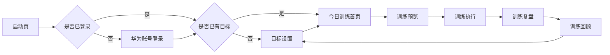

# FitTracker 产品需求文档（PRD）

**版本：** 云端化修订版
**日期：** 2026-08-19
**定位：** HarmonyOS 云端为主的目标驱动训练助手
**核心原则：** 不接入 MuscleWiki 官方 API；用户业务数据以 HarmonyOS Cloud 为权威存储；动作与媒体内容由自建内容服务/CDN 提供。

## 1. 产品背景

FitTracker 面向有明确训练目标但不想手动安排训练计划的用户。产品以“训练目标”为起点，根据用户选择的目标、训练频率、单次时长和器械条件生成本周计划，并在每次训练后完成记录、复盘与目标调整。

MuscleWiki 在信息架构上提供参考：动作按肌群、器械、难度组织，并通过动作视频帮助用户理解动作要点。FitTracker 不复制其官方数据和接口，而是建立自有动作库与视频素材库，通过自建内容服务或 CDN 供 App 调用。

FitTracker 采用 HarmonyOS Cloud 云端为主。用户使用 HarmonyOS 账号登录后，训练目标、计划清单与当前计划、训练会话、个人资料写入云端，并可在不同设备恢复；动作库与图片/视频通过自建内容服务或 CDN 分发。产品不依赖 MuscleWiki 官方 API；弱网或离线时读取本地缓存，业务写操作需联网和登录。

## 2. 产品目标

1. 让用户在 1 分钟内完成训练目标设置。
2. 自动生成本周训练计划，并明确“今天该练什么”。
3. 支持训练预览、训练执行、训练复盘、训练回顾的完整闭环。
4. 建立自有动作库与视频数据模型，并由云端内容服务/CDN 提供，为后续内容扩展打基础。
5. 基于 HarmonyOS Account Kit 登录，核心数据云端为主，支持跨设备恢复。
6. 弱网或离线时读取最近一次成功同步的缓存，业务写操作失败时明确提示。

## 3. MVP 范围

### 3.1 核心链路

启动页先判断是否已登录 HarmonyOS 账号，再判断是否已有训练目标：

### 3.2 页面范围

| 页面 | 路由 | MVP 职责 |
| --- | --- | --- |
| 启动页 | `app/StartupPage` | 判断登录状态与本地目标，路由到登录、目标设置或首页 |
| 目标设置 | `features/onboarding/pages/GoalSetupPage` | 保存目标、频率、时长、器械条件 |
| 今日训练首页 | `pages/HomePage` | 读取目标，生成计划，展示本周安排和今日训练入口 |
| 训练预览 | `features/workout/pages/WorkoutPreviewPage` | 展示今日动作、组数、次数和注意事项 |
| 训练执行 | `features/workout/pages/ActiveWorkoutPage` | 记录完成情况并保存训练会话 |
| 训练复盘 | `features/workout/pages/WorkoutSummaryPage` | 展示本次训练结果和反馈入口 |
| 训练回顾 | `features/review/pages/ReviewHomePage` | 汇总最近训练，支持调整目标 |
| 动作详情 | `features/exercise/pages/ExerciseDetailPage` | 展示动作说明，为后续视频接入预留 |

旧版登录、注册、计划列表、个人中心、占位动作库、肌群覆盖、PR 页面不进入 MVP 主入口。表格中的路由名保留既有 PRD 描述，不作为当前主线实现依据；本次仅新增登录前置，不修正旧路由。

## 4. 用户画像

| 用户 | 需求 | FitTracker 解决方式 |
| --- | --- | --- |
| 新手训练者 | 不知道今天练什么 | 先选目标，再自动生成今日训练 |
| 稳定训练者 | 想记录完成情况 | 执行页保存训练会话，复盘页展示结果 |
| 居家训练者 | 器械有限 | 目标设置中记录器械条件，计划生成时匹配 |
| 自我调整用户 | 想根据状态调整计划 | 回顾页提供调整目标入口 |
| 换机或多设备用户 | 想在新设备继续训练 | HarmonyOS 账号登录后从云端恢复目标、计划、训练记录与个人资料 |

## 5. 功能需求

### 5.1 目标设置

用户可设置：

- 训练目标：增肌、减脂、力量、塑形或恢复。
- 每周训练天数。
- 单次训练时长。
- 器械条件。
- 训练经验或强度偏好。

系统将目标保存到 HarmonyOS Cloud，并更新本地缓存，作为 `PlanEngine.generatePlan(goal)` 的输入。

### 5.2 今日训练首页

首页必须：

- 从云端读取已保存目标，离线时使用最近成功同步的本地缓存。
- 调用计划引擎生成本周计划。
- 标记今天对应训练日。
- 展示今日动作数量和动作名称。
- 提供“开始今日训练”和“查看训练回顾”入口。
- 未设置目标时，引导进入目标设置。

### 5.3 训练预览

训练预览必须：

- 展示今日训练主题。
- 展示动作列表、推荐组数、次数、休息时间。
- 提供动作详情入口。
- 提供开始训练入口。

### 5.4 训练执行

训练执行必须：

- 展示当前训练动作。
- 支持记录动作完成状态。
- 将训练会话提交到 HarmonyOS Cloud；网络失败时提示保存失败，不把失败会话当作已落库的正式业务数据。
- 完成后跳转训练复盘。

### 5.5 训练复盘

训练复盘必须：

- 展示训练完成时间、动作完成数和训练摘要。
- 支持返回首页。
- 支持进入训练回顾。

### 5.6 训练回顾

训练回顾必须：

- 从云端读取训练会话，离线时回退到最近成功同步的本地缓存。
- 展示最近训练记录和总体反馈。
- 提供查看最近复盘入口。
- 提供调整目标入口，形成闭环。

### 5.7 云端动作库与视频内容

MVP 先确定数据结构和导入方式，不要求完整内容入库。动作元数据与视频 URL 由自建内容服务/CDN 提供，本地仅做缓存。后续动作库应支持：

- 按肌群、器械、难度、动作模式检索。
- 动作详情包含中文名称、英文名称、步骤、注意事项、常见错误。
- 视频以自有文件或自建 CDN URL 管理，不调用 MuscleWiki 官方接口。
- 计划引擎从动作库中选择动作，而不是硬编码动作。

### 5.8 账号与云端数据

- 使用 HarmonyOS Account Kit 一键登录。
- 用户业务数据（训练目标、计划清单与当前计划、训练会话、个人资料）写入 HarmonyOS Cloud。
- 账号 token 由华为账号服务管理。
- 订阅权益由 AppGallery Connect IAP/服务端校验。

### 5.9 离线与同步策略

- 云端为主，服务端为唯一权威。
- 离线时只读缓存，恢复联网后重新拉取云端数据。
- 业务写操作需联网和登录，失败时明确提示。
- 多设备冲突按服务端接收时间最近写入为准。
- 训练草稿、调试数据和启动请求仅保存在本地。

## 6. 非功能需求

| 类型 | 要求 |
| --- | --- |
| 云端为主 | 用户业务数据默认保存在 HarmonyOS Cloud，本地仅保留缓存和临时草稿 |
| 可用性 | 弱网或离线时只读缓存可用，业务写操作失败时明确提示 |
| 同步一致性 | 服务端为唯一权威，多设备冲突按服务端接收时间最近写入为准 |
| 可扩展 | 动作库、训练计划、视频素材独立建模 |
| 可维护 | ArkTS 严格模式通过，服务层与页面职责清晰 |
| 中文体验 | 所有用户可见文案使用简体中文 |
| 隐私与安全 | 传输与静态存储加密，仅上传完成核心业务所需的数据，遵循隐私合规要求 |

## 7. 数据需求

| 数据 | 来源 | 存储 |
| --- | --- | --- |
| 用户目标 | 目标设置页 | HarmonyOS Cloud（本地缓存） |
| 计划清单与当前计划 | 计划启用与切换 | HarmonyOS Cloud |
| 本周训练计划 | `PlanEngine.generatePlan(goal)` | 基于云端目标运行时生成，可本地缓存 |
| 训练会话 | 训练执行页 | HarmonyOS Cloud |
| 个人资料 | 个人资料页 | HarmonyOS Cloud |
| 动作元数据 | 后续自建数据导入 | 云端内容服务/CDN + 本地缓存 |
| 视频资产 | 后续自有素材 | 云端内容服务/CDN + 本地缓存 |
| 训练草稿 | 训练执行中的临时态 | 本地 |
| 调试数据与启动请求 | 开发调试与冷启动 | 本地 |
| 账号 token | HarmonyOS Account Kit | 华为账号服务 |
| 订阅权益 | AppGallery Connect IAP | AppGallery Connect IAP/服务端 |

## 8. 成功指标

MVP 验收以链路完成为主：

- 首次进入 App 可完成华为账号登录和目标设置。
- 有目标后首页可展示本周计划和今日训练。
- 可从首页进入预览、执行、复盘、回顾。
- 回顾页可回到目标设置调整目标。
- 登录后云端数据可跨设备恢复目标、计划、训练记录与个人资料。
- 断网时只读缓存可用，联网后业务写入成功。
- 关键数据在传输与静态存储中加密。
- 构建通过，无 ArkTS 严格模式编译错误。

## 9. 明确不做

- 不接入 MuscleWiki 官方 API。
- 不抓取或内置未经授权的视频素材。
- 本次修订不做社区、会员和支付能力；云存储与账号登录属于本次新增范围。
- 不在 MVP 暴露旧版多入口页面。
- 不把动作库和训练计划混在页面中硬编码扩展。
