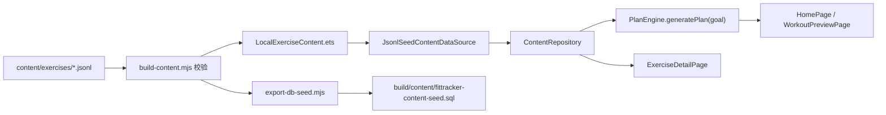

# FitTracker 内容导入说明

**适用范围：** 本地动作库、肌群、器械种子数据
**当前策略：** 维护 JSONL 源文件，构建前自动校验并生成 ArkTS 内容模块
**重要规则：** 修改 `content/exercises/*.jsonl` 后，提交前仍要确认 `LocalExerciseContent.ets` 已被重新生成
**运行时补充：** 启动页会优先尝试加载本地数据库内容；如果本地库不存在或加载失败，会回退到 JSONL 种子源，并可再次执行导入流程重建本地库

## 1. 文件职责

| 文件或目录 | 职责 |
| --- | --- |
| `content/exercises/muscles.zh-CN.jsonl` | 肌群种子数据 |
| `content/exercises/equipment.zh-CN.jsonl` | 器械种子数据 |
| `content/exercises/exercises.zh-CN.jsonl` | 动作、步骤、提示、替代动作、视频占位 |
| `tools/content/build-content.mjs` | 校验 JSONL 并生成 ArkTS 内容模块 |
| `entry/src/main/ets/generated/LocalExerciseContent.ets` | App 实际读取的生成内容 |
| `entry/src/main/ets/shared/services/ContentRepository.ets` | 内容查询、筛选和复制出口 |
| `entry/src/main/ets/shared/services/PlanEngine.ets` | 按目标、器械、肌群、难度选动作 |

## 2. 标准导入流程

每次修改动作、肌群或器械内容后，直接运行 Hvigor 构建即可。`entry/hvigorfile.ts` 已注册 `generateLocalExerciseContent` 前置任务，会在 `default@PreBuild` 和 `ohosTest@PreBuild` 前先执行 `tools/check-main-pages.mjs`，再执行 `tools/content/build-content.mjs`。

```powershell
$env:JAVA_HOME='C:\Program Files\Huawei\DevEco Studio\jbr'
$env:DEVECO_SDK_HOME='C:\Program Files\Huawei\DevEco Studio\sdk'
$env:PATH='C:\Program Files\Huawei\DevEco Studio\jbr\bin;C:\Program Files\Huawei\DevEco Studio\tools\hvigor\bin;C:\Program Files\Huawei\DevEco Studio\sdk\default\openharmony\toolchains;' + $env:PATH

& 'C:\Program Files\Huawei\DevEco Studio\tools\hvigor\bin\hvigorw.bat' assembleHap --mode module -p module=entry@ohosTest -p product=default
& 'C:\Program Files\Huawei\DevEco Studio\tools\hvigor\bin\hvigorw.bat' assembleHap --mode module -p module=entry@default -p product=default
```

如果只想快速校验 JSONL 或单独刷新生成文件，可以手动运行：

```powershell
node tools/content/build-content.mjs
```

提交时必须同时包含：

- 修改后的 JSONL 源文件。
- 重新生成后的 `entry/src/main/ets/generated/LocalExerciseContent.ets`。
- 如筛选逻辑变化，包含对应的 `ContentRepository.test.ets` 或相关测试。

## 3. JSONL 格式规则

### 3.1 肌群

每行一个 JSON 对象：

```json
{"muscleId":"muscle_chest","nameZh":"胸部","region":"upper"}
```

必填字段：

- `muscleId`
- `nameZh`
- `region`

### 3.2 器械

每行一个 JSON 对象：

```json
{"equipmentId":"eq_bodyweight","nameZh":"徒手"}
```

必填字段：

- `equipmentId`
- `nameZh`

### 3.3 动作

每行一个 JSON 对象。字段较多，建议复制已有动作后修改：

```json
{"exerciseId":"ex_push_up","nameZh":"俯卧撑","nameEn":"Push Up","aliases":["pushup"],"primaryMuscleIds":["muscle_chest"],"secondaryMuscleIds":["muscle_shoulders","muscle_arms","muscle_core"],"equipmentIds":["eq_bodyweight"],"difficulty":"beginner","goalTags":["hypertrophy","fat_loss"],"videoUrl":"","coverUrl":"","steps":["双手撑地略宽于肩，脚尖着地，身体从头到脚保持一条直线"],"cues":["收紧腹部和臀部"],"commonMistakes":["塌腰或抬臀过高"],"safetyNotes":["肩前侧疼痛时减少幅度或停止"],"alternativeExerciseIds":["ex_dumbbell_bench_press"],"contentVersion":1}
```

必填字段：

- `exerciseId`
- `nameZh`
- `nameEn`
- `aliases`
- `primaryMuscleIds`
- `secondaryMuscleIds`
- `equipmentIds`
- `difficulty`
- `goalTags`
- `videoUrl`
- `coverUrl`
- `steps`
- `cues`
- `commonMistakes`
- `safetyNotes`
- `alternativeExerciseIds`
- `contentVersion`

## 4. 校验规则

`node tools/content/build-content.mjs` 会检查：

- JSONL 每一行必须是合法 JSON。
- `muscleId`、`equipmentId`、`exerciseId` 必须唯一。
- 动作必须至少有一个主肌群。
- 动作必须至少有一个器械。
- 动作必须至少有一个步骤。
- `difficulty` 只能是 `beginner`、`intermediate`、`advanced`。
- 动作引用的肌群 ID 必须存在于 `muscles.zh-CN.jsonl`。
- 动作引用的器械 ID 必须存在于 `equipment.zh-CN.jsonl`。
- `alternativeExerciseIds` 引用的动作 ID 必须存在于 `exercises.zh-CN.jsonl`。

脚本失败时，不要手动改生成文件绕过校验；先修 JSONL 源文件。

## 5. App 读取链路



如需生成后续本地数据库导入用 SQL 种子文件，运行：

```powershell
node tools/content/export-db-seed.mjs
```

该脚本会先执行 `tools/content/build-content.mjs`，校验失败时不会生成数据库种子。

## 6. 常见错误

| 错误 | 处理方式 |
| --- | --- |
| 改了 JSONL 但页面没变化 | 重新运行 Hvigor 构建；如只需刷新生成文件，运行 `node tools/content/build-content.mjs` |
| 脚本提示 unknown muscle | 先在 `muscles.zh-CN.jsonl` 添加肌群，或修正动作里的肌群 ID |
| 脚本提示 unknown equipment | 先在 `equipment.zh-CN.jsonl` 添加器械，或修正动作里的器械 ID |
| 脚本提示 unknown alternative | 确认替代动作已经存在，或从 `alternativeExerciseIds` 删除 |
| 构建里动作缺失 | 检查 `goalTags`、`difficulty`、`equipmentIds` 是否能被 `PlanEngine` 筛到 |

## 7. MuscleWiki 边界

本流程只维护 FitTracker 自有内容。禁止接入 MuscleWiki 官方 API，禁止抓取 MuscleWiki 页面数据、图片、视频或文案。外部网站只能作为信息架构参考。
## 8. 本地内容同步包

当前内容构建除了生成 `LocalExerciseContent.ets`，还会同步生成 `entry/src/main/ets/generated/LocalContentSyncPackage.ets`。

用途：

- 给 `SyncService` 提供 app 内置 bundled manifest
- 在启动时比较“当前数据库内容版本”和“内置内容包版本”
- 当 bundled 版本更高时，触发本地数据库事务导入并切到数据库内容源

同步包的附加清单来自 `content/exercises/content-sync.manifest.json`，当前只提供：

- `releaseChannel`
- `sourceNote`
- `generatedAt`

其余 manifest 字段会在构建时按当前 JSONL 实际内容自动计算，例如：

- `packageVersion`
- `exerciseCount`
- `packageChecksum`
- `packageSizeBytes`
