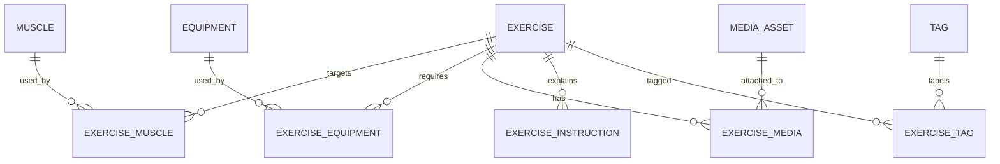

# FitTracker 动作/视频自建数据库方案

**版本：** 初始方案  
**日期：** 2026-05-23  
**原则：** 自建动作库和视频素材库，不接入 MuscleWiki 官方 API，不抓取未经授权素材。

## 1. 方案目标

建立可维护、可导入、可离线使用的动作与视频数据结构，让 FitTracker 后续从“硬编码计划动作”过渡到“根据目标和动作库生成训练计划”。

## 2. 数据来源原则

- 动作名称、描述、步骤、注意事项由项目自建维护。
- 视频使用自制、授权或公开许可明确的素材。
- 外部网站只能作为产品信息架构参考，不作为数据接口来源。
- 每条内容必须记录来源、授权类型、版本和审核状态。

## 3. 数据分层



## 4. 表结构

### 4.1 `exercise`

| 字段 | 类型 | 必填 | 说明 |
| --- | --- | --- | --- |
| `id` | text | 是 | 动作 ID，例如 `push_up` |
| `name_zh` | text | 是 | 中文名 |
| `name_en` | text | 否 | 英文名 |
| `slug` | text | 是 | URL 或导入用稳定标识 |
| `difficulty` | text | 是 | `beginner` / `intermediate` / `advanced` |
| `movement_pattern` | text | 是 | `push` / `pull` / `squat` / `hinge` / `carry` / `core` |
| `force_type` | text | 否 | `push` / `pull` / `static` |
| `mechanic_type` | text | 否 | `compound` / `isolation` |
| `is_unilateral` | integer | 是 | 0 或 1 |
| `status` | text | 是 | `draft` / `reviewed` / `published` |
| `created_at` | text | 是 | ISO 时间 |
| `updated_at` | text | 是 | ISO 时间 |

### 4.2 `muscle`

| 字段 | 类型 | 必填 | 说明 |
| --- | --- | --- | --- |
| `id` | text | 是 | 肌群 ID，例如 `chest` |
| `name_zh` | text | 是 | 中文名 |
| `name_en` | text | 否 | 英文名 |
| `region` | text | 是 | `upper` / `lower` / `core` / `full_body` |

### 4.3 `exercise_muscle`

| 字段 | 类型 | 必填 | 说明 |
| --- | --- | --- | --- |
| `exercise_id` | text | 是 | 关联动作 |
| `muscle_id` | text | 是 | 关联肌群 |
| `role` | text | 是 | `primary` / `secondary` / `stabilizer` |

### 4.4 `equipment`

| 字段 | 类型 | 必填 | 说明 |
| --- | --- | --- | --- |
| `id` | text | 是 | 器械 ID，例如 `bodyweight` |
| `name_zh` | text | 是 | 中文名 |
| `name_en` | text | 否 | 英文名 |
| `category` | text | 是 | `bodyweight` / `free_weight` / `machine` / `band` |

### 4.5 `exercise_equipment`

| 字段 | 类型 | 必填 | 说明 |
| --- | --- | --- | --- |
| `exercise_id` | text | 是 | 关联动作 |
| `equipment_id` | text | 是 | 关联器械 |
| `is_required` | integer | 是 | 0 或 1 |

### 4.6 `exercise_instruction`

| 字段 | 类型 | 必填 | 说明 |
| --- | --- | --- | --- |
| `id` | text | 是 | 指令 ID |
| `exercise_id` | text | 是 | 关联动作 |
| `step_order` | integer | 是 | 步骤顺序 |
| `text_zh` | text | 是 | 中文步骤 |
| `instruction_type` | text | 是 | `setup` / `execution` / `breathing` / `safety` / `mistake` |

### 4.7 `media_asset`

| 字段 | 类型 | 必填 | 说明 |
| --- | --- | --- | --- |
| `id` | text | 是 | 媒体 ID |
| `asset_type` | text | 是 | `video` / `image` |
| `storage_type` | text | 是 | `local` / `cdn` |
| `uri` | text | 是 | 本地路径或自建 CDN URL |
| `thumbnail_uri` | text | 否 | 缩略图路径 |
| `duration_seconds` | integer | 否 | 视频时长 |
| `width` | integer | 否 | 像素宽 |
| `height` | integer | 否 | 像素高 |
| `license_type` | text | 是 | `owned` / `licensed` / `open_license` |
| `source_note` | text | 是 | 来源说明 |
| `checksum` | text | 否 | 文件校验值 |

### 4.8 `exercise_media`

| 字段 | 类型 | 必填 | 说明 |
| --- | --- | --- | --- |
| `exercise_id` | text | 是 | 关联动作 |
| `media_id` | text | 是 | 关联媒体 |
| `view_angle` | text | 是 | `front` / `side` / `three_quarter` / `detail` |
| `sort_order` | integer | 是 | 展示顺序 |

### 4.9 `tag` 与 `exercise_tag`

| 表 | 字段 | 说明 |
| --- | --- | --- |
| `tag` | `id`, `name_zh`, `category` | 标签定义 |
| `exercise_tag` | `exercise_id`, `tag_id` | 动作标签关系 |

## 5. 导入格式

第一阶段使用 JSON Lines，便于人工审核和增量导入。

文件建议：

```text
content/exercises/exercises.zh-CN.jsonl
content/exercises/muscles.zh-CN.jsonl
content/exercises/equipment.zh-CN.jsonl
content/exercises/exercise_muscles.jsonl
content/exercises/exercise_equipment.jsonl
content/exercises/instructions.zh-CN.jsonl
content/exercises/media_assets.jsonl
content/exercises/exercise_media.jsonl
```

示例：

```json
{"id":"push_up","name_zh":"俯卧撑","name_en":"Push-up","slug":"push-up","difficulty":"beginner","movement_pattern":"push","force_type":"push","mechanic_type":"compound","is_unilateral":0,"status":"draft","created_at":"2026-05-23T00:00:00+08:00","updated_at":"2026-05-23T00:00:00+08:00"}
```

## 6. 导入流程


校验规则：

- `id`、`slug` 全局唯一。
- `exercise_muscle` 必须至少有一个 `primary` 肌群。
- `exercise_equipment` 缺省必须包含 `bodyweight` 或明确器械。
- `media_asset.license_type` 不得为空。
- `published` 状态的动作必须有步骤说明。
- 视频不是发布必填项，但有视频时必须包含授权说明。

## 7. App 集成路线

### 第一阶段：静态种子数据

- 用 JSONL 维护 20 到 50 个核心动作。
- 构建时或首次启动时导入本地数据库。
- 动作详情页从动作库读取内容。

### 第二阶段：计划引擎接动作库

- `PlanEngine` 根据目标、肌群、器械和难度筛选动作。
- 训练预览展示动作库中的步骤和注意事项。
- 继续保持本地优先。

### 第三阶段：自建内容服务

- 后台维护动作、视频、审核状态。
- App 拉取已发布数据包。
- 支持版本号、增量包和回滚。

## 8. 与 MuscleWiki 的边界

- 可参考其“肌群 -> 动作 -> 视频说明”的产品组织方式。
- 不调用官方 API。
- 不抓取页面数据。
- 不复制其视频、图片、文案或数据库。
- FitTracker 内容必须由自有编辑流程生成并审核。
